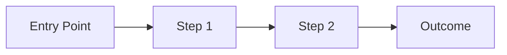

# PRD

Session: <SESSION_NAME>
Date: <YYYY-MM-DD>

---

## Summary
[One-paragraph overview of the session's scope]

## Goals
1. [Goal 1]
2. [Goal 2]

## Non-goals
- [Explicitly what is NOT in scope]

## Target users
- [Who consumes the output]

## Content requirements
[Content models, data structures, mock data requirements]

## Functional requirements
[Feature list and specifications]

## UX requirements
[User experience and interface requirements]

## User Flow (optional diagram)
<!-- Add a Mermaid flowchart if the session has a clear user journey -->
<!--

-->

## Technical requirements
[Tech stack, architecture, patterns]

## Risks / assumptions
### Risks
- [Risk 1 + Mitigation]

### Assumptions
- [Assumption 1]

## Open questions
- [Q1: Question about ambiguous requirement]
