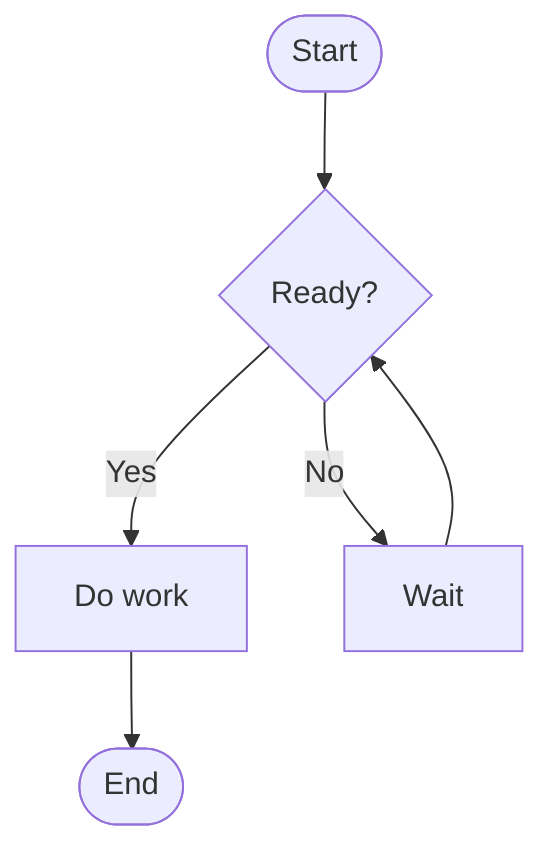
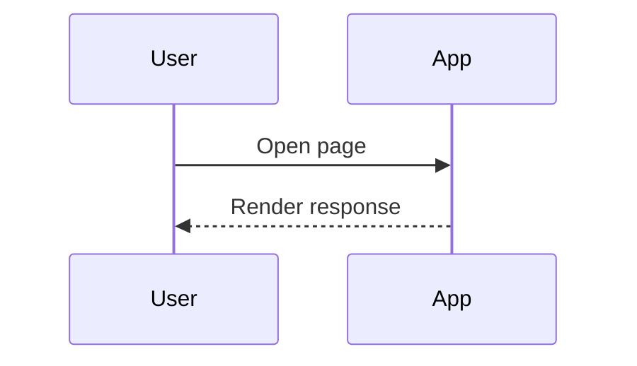

# Mermaid Markdown Template

Use this file when you want a Markdown document that can either render Mermaid live in a capable host or be transformed into static assets with `mmdc`.

## Flow Example



## Sequence Example



## Render This Markdown

```bash
mmdc -i mermaid-doc-template.md -o mermaid-doc-template.rendered.md
```
