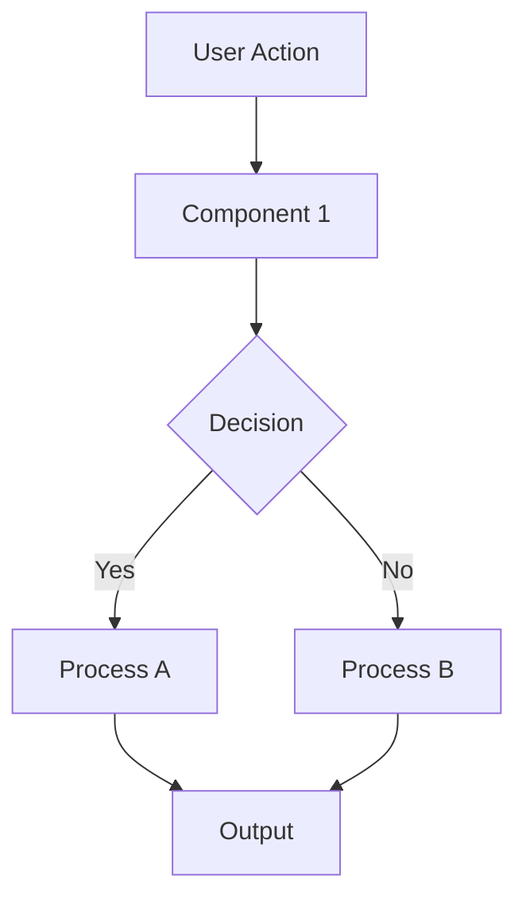
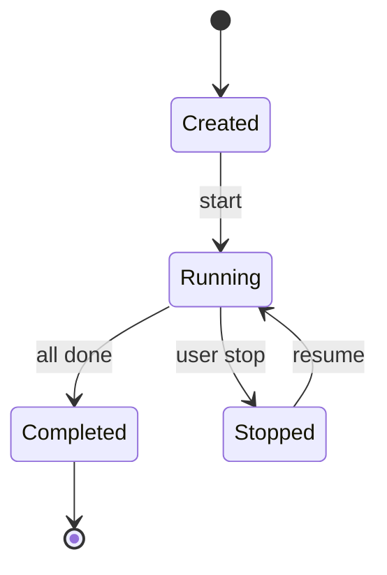
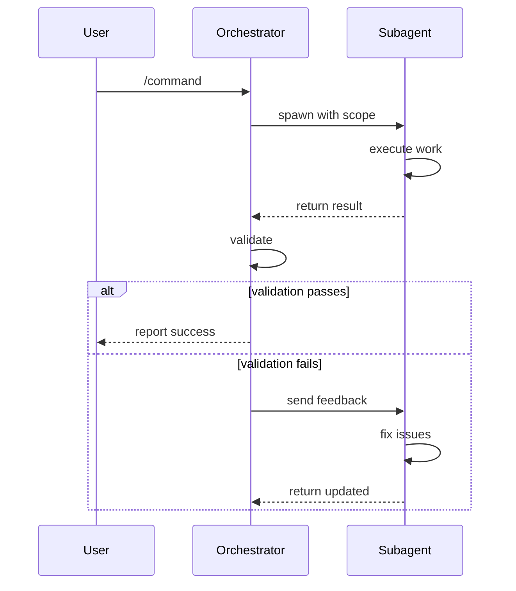
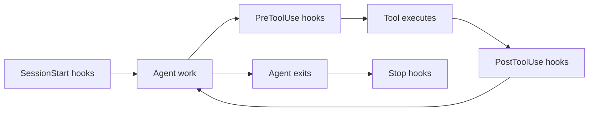

# [System Name] — Technical Architecture

## System Flow



## State Machine



## Sequence Diagram (for multi-agent systems)



## Component Relationships

```
┌─────────────────────────────────────────┐
│              System Name                 │
├──────────┬──────────┬───────────────────┤
│  Agent   │  Skill   │  Hook             │
│          │          │                   │
│  (who)   │  (how)   │  (when/enforce)   │
└──────────┴──────────┴───────────────────┘
        │          │           │
        ▼          ▼           ▼
   Spawned by   Loaded by   Fires on
   hook/agent   agent/user  tool events
```

## Hook Execution Order



## Key Algorithms

### [Algorithm Name]
```
function algorithmName(input):
    1. [step 1]
    2. [step 2]
    3. if [condition]:
         [action A]
       else:
         [action B]
    4. return [output]
```

## Error Handling

| Error | Detection | Recovery |
|---|---|---|
| [Error type 1] | [How detected] | [How to recover] |
| [Error type 2] | [How detected] | [How to recover] |
