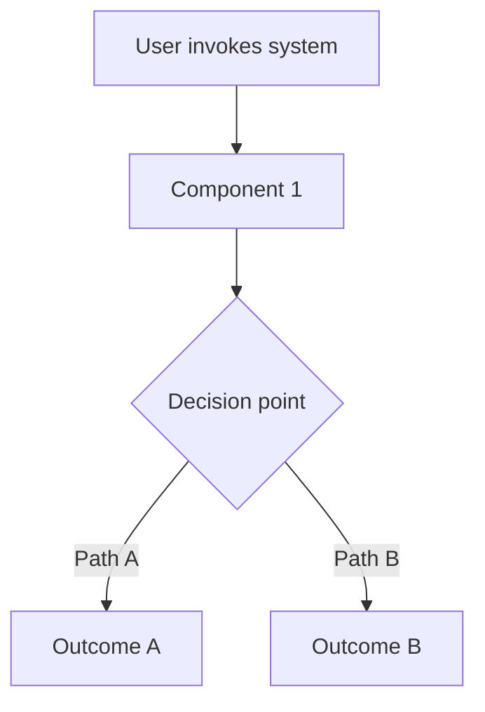

# [System Name] System

## Overview
[2-3 sentences: what this system does and why it exists.]

## Components

| Component | Path | Purpose |
|---|---|---|
| **Skill** | `.claude/skills/<name>/SKILL.md` | [What the skill defines] |
| **Agent** | `.claude/agents/<name>/AGENT.md` | [What the agent does] |
| **Hook** | `.claude/hooks/scripts/<name>.sh` | [What the hook enforces] |
| **Command** | `.claude/commands/<name>.md` | [What the slash command triggers] |

## Architecture

## How to Use
- [Primary invocation method]
- [Secondary method if applicable]

## Integration Points

| System | Relationship |
|---|---|
| `<other-system>` | [How this system relates] |

## Related Docs
- `USAGE_GUIDE.md` — detailed how-to with examples
- `ARCHITECTURE.md` — technical diagrams and flow logic
