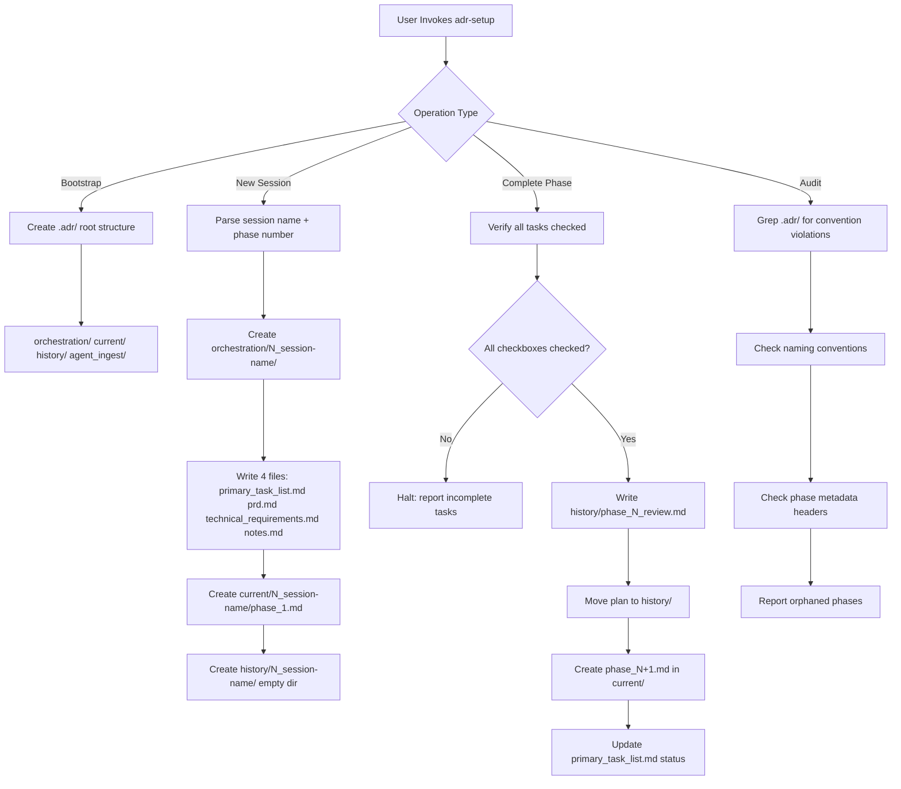
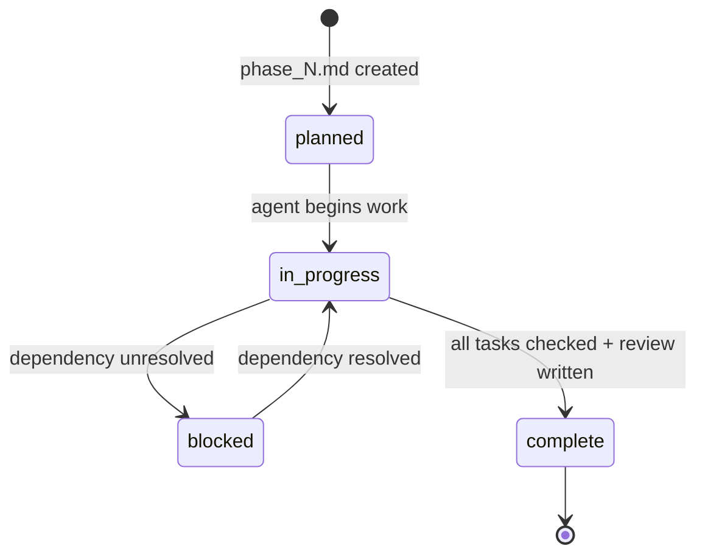

# Architecture: ADR Setup

## Component Flow



## Phase Lifecycle State Machine



## Required Phase File Header

Every `phase_N.md` must contain this frontmatter block or the agent rejects it:

```
Phase: phase_N
Session: N_session-name
Date: YYYY-MM-DD
Owner: <agent-name>
Status: planned | in_progress | blocked | complete
```

## File Creation Order (New Session)

1. `orchestration/N_name/primary_task_list.md` — master checklist
2. `orchestration/N_name/prd.md` — product requirements
3. `orchestration/N_name/technical_requirements.md` — tech decisions
4. `orchestration/N_name/notes.md` — running log
5. `current/N_name/phase_1.md` — first phase plan with required header
6. `history/N_name/` — empty directory placeholder

## Phase Completion Order

1. Verify all `[ ]` checkboxes in `current/.../phase_N.md` are `[x]`
2. Write `history/.../phase_N_review.md` (summary of what was done)
3. Move `current/.../phase_N.md` → `history/.../phase_N.md`
4. Create `current/.../phase_N+1.md` with Status: planned
5. Update `orchestration/.../primary_task_list.md` phase status line

## Error Handling

| Error | Trigger | Action |
|-------|---------|--------|
| Incomplete phase | `[ ]` items remain at completion | Halt, list unchecked items |
| Missing metadata | phase file lacks frontmatter | Prompt to add before continuing |
| Name format violation | uppercase or missing numeric prefix | Reject, provide correct format |
| Orphaned current/ files | phase in current/ with no history/ dir | Report in audit |
| Missing frontend_spec | session touches UI, no spec file | Prompt user to provide spec |
| Duplicate session number | N already used in orchestration/ | Halt, list existing sessions |
