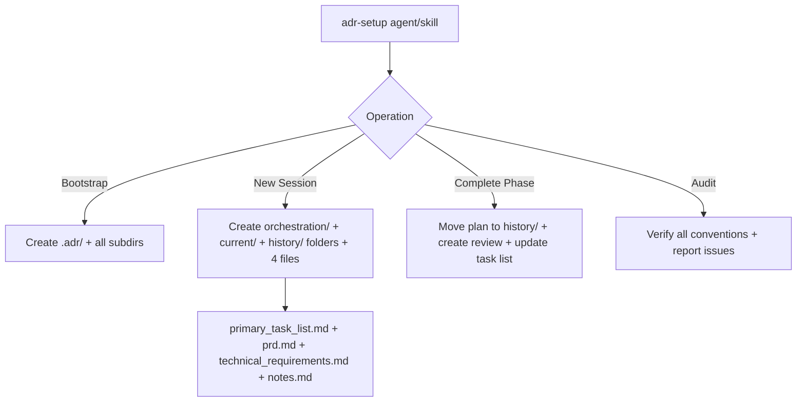

# System Docs: ADR Setup

## Overview

Sets up and maintains the `.adr/` Architecture Decision Record workspace. Manages session creation, phase lifecycle (planned → in_progress → complete), and folder convention compliance. Serves as a fallback when orchestrator agents fail to route ADR operations correctly.

## Components

| Component | Path |
|-----------|------|
| Agent | `.claude/agents/adr-setup/AGENT.md` |
| Skill | `.claude/skills/adr-setup/SKILL.md` |
| Templates | `.claude/skills/adr-setup/templates/` |
| References | `.claude/skills/adr-setup/references/conventions.md` |

## Architecture



## Folder Structure

```
.adr/
├── orchestration/<N>_SESSION_NAME/   # Permanent session docs (4 files each)
├── current/<N>_SESSION_NAME/          # Active phase files
├── history/<N>_SESSION_NAME/          # Completed phase archives
└── agent_ingest/                      # Imported agent notes
```

## Phase Lifecycle

`planned` → `in_progress` → `complete` (or `blocked` → `in_progress` → `complete`)

## How to Use

```
/agent adr-setup "Bootstrap ADR for this project with 8 sessions"
/agent adr-setup "Create session 3_auth-flow with phase 1"
/agent adr-setup "Complete phase 2 of 3_auth-flow"
/agent adr-setup "Audit the .adr/ folder structure"
```

## Integration Points

- **session_orchestration** — The orchestrator creates and completes phases using this system
- **frontend_spec** — Sessions with frontend work require `frontend_spec.md` (prompted if missing)
- **todo_tracker** — Reads `.adr/orchestration/` to populate TODO.md with session phases
