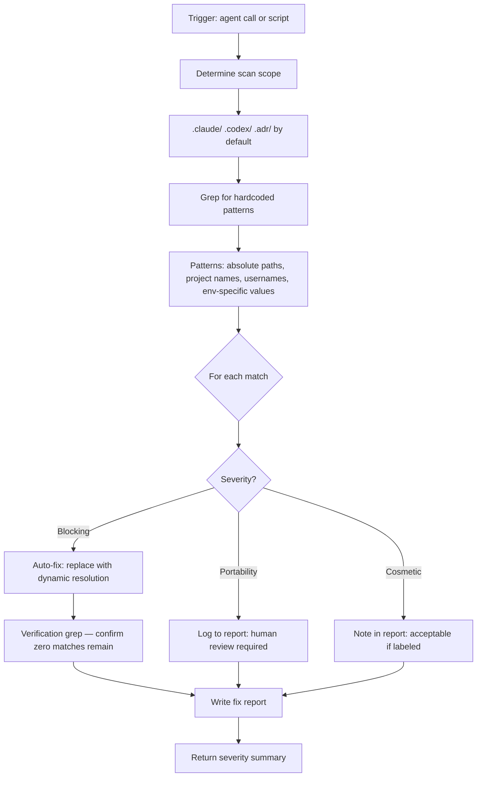

# Architecture: Agnostic Verification

## Scan and Fix Flow



## Severity Classification

| Severity | Definition | Examples | Disposition |
|----------|------------|---------|-------------|
| **Blocking** | Breaks cross-machine portability immediately | `C:\coding\apps\`, `C:/coding/`, `/home/user/`, hardcoded `workdir` in JSON | Auto-fix |
| **Portability** | Works on this machine, fails on others | Project name in docs, session-specific paths in templates | Report for human review |
| **Cosmetic** | In example code or comments — never executed | `C:\coding\` inside a fenced code block labeled as example | Note only |

## Dynamic Resolution Patterns

The agent replaces hardcoded paths with these portable equivalents by file type:

| File Type | Hardcoded | Portable Replacement |
|-----------|-----------|----------------------|
| `.ps1` | `$dir = "C:\coding\..."` | `$repoRoot = (Resolve-Path (Join-Path $PSScriptRoot "..\..\..")).Path` |
| `.js` / `.mjs` | `const BASE = 'C:/coding/'` | `path.resolve(__dirname, '..', '..', '..', '..')` |
| `.sh` | `ROOT="C:/coding/..."` | `ROOT="$(git rev-parse --show-toplevel)"` |
| `.json` | `"workdir": "C:\..."` | `"workdir": ""` |
| `.md` (docs) | `C:\coding\apps\myproject` | `<PROJECT_ROOT>` |

## Depth Calculation for Dynamic Resolution

When replacing `__dirname`-relative paths, the agent counts directory depth:
- `.claude/skills/my-skill/scripts/my-script.js` → depth 4 from repo root → `path.resolve(__dirname, '..', '..', '..', '..')`

## Scan Patterns (grep targets)

```
C:\coding\
C:/coding/
/home/
/Users/
<specific project names>
<specific usernames>
```

## Error Handling

| Error | Trigger | Action |
|-------|---------|--------|
| False positive in example block | Hardcoded path inside ````code```` block | Cosmetic severity — note but don't auto-fix |
| Script not found | Running outside repo root | Print path resolution hint |
| Fix breaks functionality | Dynamic path resolves to wrong depth | Verify `__dirname` depth manually, adjust `..` count |
| Scan finds no issues | Clean repo | Report "fully agnostic" with zero findings |
| JSON workdir empty string | Post-fix value unclear | Leave empty string `""` — callers must resolve at runtime |
