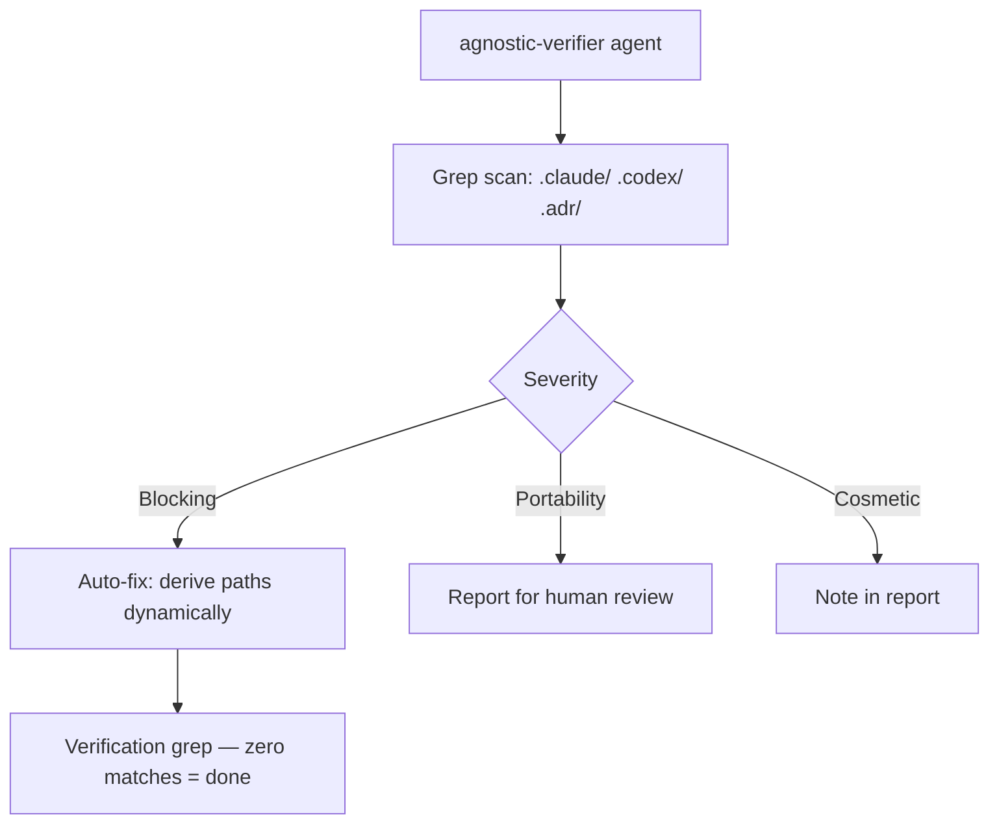

# System Docs: Agnostic Verification

## Overview

Scans agents, skills, hooks, and orchestration files for hardcoded paths, project-specific names, and environment-coupled values that break portability across repos. Fixes or reports findings by severity.

## Components

| Component | Path |
|-----------|------|
| Agent | `.claude/agents/agnostic-verifier/AGENT.md` |
| Skill | `.claude/skills/verifying-agnosticism/SKILL.md` |
| Scan Script | `.claude/skills/verifying-agnosticism/scripts/scan-hardcoded-paths.js` |

## Architecture



## Severity Levels

| Severity | Examples | Action |
|----------|----------|--------|
| Blocking | `C:\coding\...` in scripts, hardcoded `workdir` in JSON | Auto-fix |
| Portability | Project names in docs, session names in templates | Report |
| Cosmetic | Hardcoded paths in Mermaid diagrams, example code | Note |

## How to Use

Run the agent after syncing template files from another repo, or before publishing agents/skills:

```
/agent agnostic-verifier "Scan all .claude/ and .codex/ files for hardcoded paths"
```

Or use the skill script directly:
```bash
node .claude/skills/verifying-agnosticism/scripts/scan-hardcoded-paths.js
```

## Integration Points

- **claude_codex_sync** — Run agnostic verification after any sync to ensure no project-specific values leaked in
- **creating-claude-agents / creating-claude-skills** — Templates should be verified before distribution
- **onboarding** — Run once when cloning a template repo into a new project
