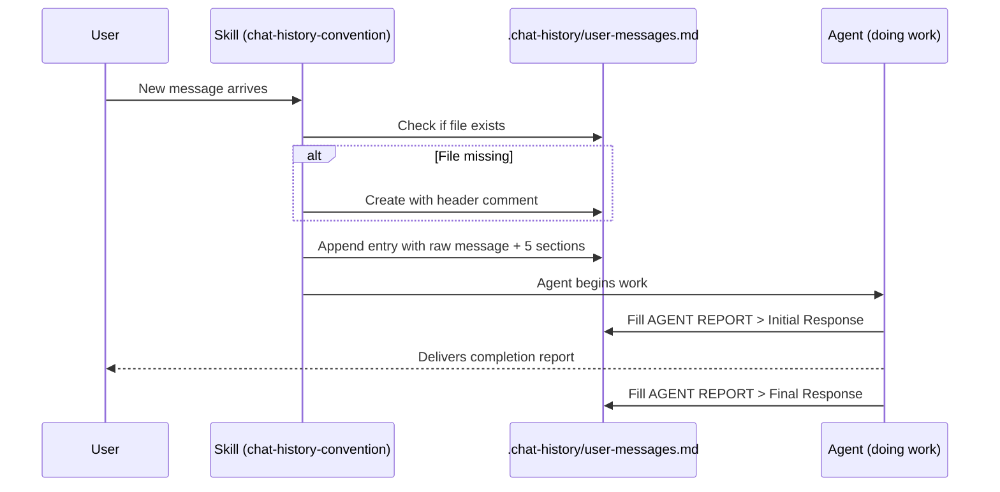

# Architecture: Chat History

## Entry Lifecycle



## Entry Structure

```
---
[ISO-8601 timestamp] role=user
<raw message verbatim — never edited>

SESSION CONTEXT:
- Current task, active agents, phase of work

USER INTENT:
1. Imperative action item
2. Imperative action item

REFERENCE FILES:
- path/to/file — description

KEY DECISIONS:
- Decision or "None — request only."

AGENT REPORT:
  Initial Response:
  - Plan + commitments + questions

  Final Response:
  - Files created/modified, systems affected, sync status
---
```

## Section Priority Order

The sections are ordered by value for session reconstruction:

1. **Raw message** — ground truth of what was asked
2. **USER INTENT** — most important: translates natural language to requirements
3. **SESSION CONTEXT** — positions the message in the work timeline
4. **AGENT REPORT** — turns the log into a full conversation record
5. **REFERENCE FILES** — resolves contextual references to actual paths
6. **KEY DECISIONS** — tracks preference evolution

## Append Algorithm

1. Derive ISO-8601 timestamp from system clock
2. Verify `.chat-history/` directory exists (create if not)
3. Verify `user-messages.md` exists (create with intro comment if not)
4. Write entry: separator line → timestamp header → raw message → 5 sections
5. Do not truncate, rotate, or compress — log is append-only forever

## Short Message Handling

All sections are required even for single-word responses. Proportionally brief is acceptable:
- SESSION CONTEXT: 1 bullet
- USER INTENT: 1 bullet  
- KEY DECISIONS: "None — request only."
- AGENT REPORT: "No agent work — conversational response only."

## Error Handling

| Error | Trigger | Action |
|-------|---------|--------|
| File not found | First run in a new repo | Create `.chat-history/user-messages.md` |
| Directory not found | `.chat-history/` absent | Create directory first |
| Blank AGENT REPORT | Agent forgets to fill in | Agent must actively complete both sub-sections |
| Stale Final Response | Work still in progress | Leave blank; fill on next log entry |
| Encoding issues | Non-UTF8 in message | Preserve as-is; log format is UTF-8 only |
