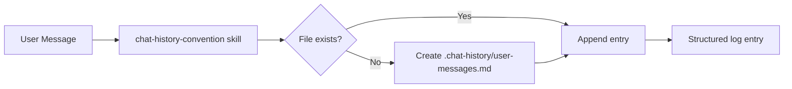

# System Docs: Chat History

## Overview

Maintains a project-local transcript of every user message in `.chat-history/user-messages.md` with structured analysis sections. Provides session continuity and intent tracking across conversations.

## Components

| Component | Path |
|-----------|------|
| Agent | `.claude/agents/chat-history-agent/AGENT.md` |
| Skill | `.claude/skills/chat-history-convention/SKILL.md` |
| Output | `.chat-history/user-messages.md` |

## Architecture



## Entry Format

Every entry includes six sections under the raw message:
1. **SESSION CONTEXT** — current task, active agents, phase of work
2. **USER INTENT** — structured breakdown of what was asked (most important section)
3. **REFERENCE FILES** — all files and paths mentioned
4. **KEY DECISIONS** — preferences, choices, constraints expressed
5. **AGENT REPORT** — Initial Response (plan) + Final Response (completion summary)

## How to Use

The skill is **mandatory** at the start of every conversation per CLAUDE.md. Invoke via:

```
/skill chat-history-convention
```

The skill runs automatically when chat-history-agent is active.

## Integration Points

- **CLAUDE.md** — declares this as a non-negotiable requirement for every session
- **All agents** — expected to fill in AGENT REPORT sections when they complete work
- **Session continuity** — future sessions read this file to reconstruct project context
