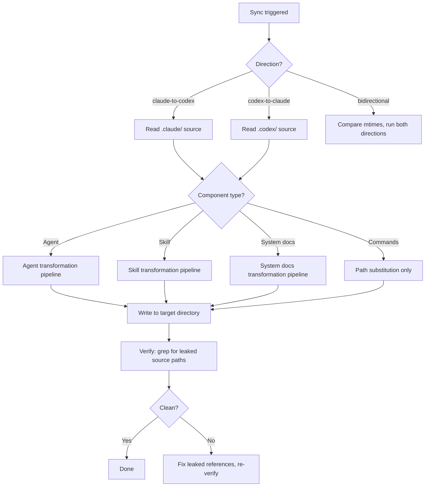

# Architecture: Claude-Codex Sync

## Sync Direction Decision



## Agent Transformation Pipeline (Claude → Codex)

```
Input: .claude/agents/<name>/agent.md  (plain markdown)
        │
        ├─ 1. Extract metadata from content
        │       name ← H1 heading
        │       description ← first paragraph
        │       tools ← keyword scan (Bash, Read, Write, etc.)
        │       expertise ← capability section headings
        │
        ├─ 2. Compose YAML frontmatter block
        │       name, description, tools[], permissions{}, expertise[]
        │
        ├─ 3. Replace .claude/ → .codex/ throughout body
        │
        ├─ 4. Write AGENT.md = frontmatter + transformed body
        │
        └─ 5. Write stub <name>.md = description + pointers
```

## Agent Transformation Pipeline (Codex → Claude)

```
Input: .codex/agents/<name>/AGENT.md  (YAML frontmatter + markdown)
        │
        ├─ 1. Strip YAML frontmatter entirely
        │
        ├─ 2. Ensure body starts with H1 (generate from YAML name if missing)
        │
        └─ 3. Replace .codex/ → .claude/ throughout body
           → Write agent.md = plain markdown body only
```

## Skills and System Docs Pipeline (Either Direction)

```
1. Copy SKILL.md (preserve YAML frontmatter)
2. Substitute .claude/ ↔ .codex/ in markdown body only
3. Copy references/, scripts/, templates/ subdirectories recursively
4. Substitute paths in .md files within subdirectories
5. Leave non-markdown files (scripts, JSON, images) unchanged
```

## Convention Differences Table

| Element | Claude | Codex |
|---------|--------|-------|
| Agent filename | `agent.md` (lowercase) | `AGENT.md` (uppercase) |
| Agent YAML frontmatter | Never present | Always required |
| Agent stub file | Not used | `agents/<name>.md` |
| Path prefix in content | `.claude/` | `.codex/` |
| Directory metadata | Not present | README.md, CATALOG.md |
| Commands directory | Not present | `.codex/commands/` |
| Hooks directory | Not present | `.codex/hooks/` |

## Error Handling

| Error | Trigger | Action |
|-------|---------|--------|
| Leaked source path | `.claude/` found in codex output | Re-run substitution on specific file |
| Missing H1 in claude agent | agent.md has no H1 | Generate from YAML name field |
| Metadata extraction ambiguous | No clear tool keywords found | Use empty array, log warning |
| Stub file conflict | `<name>.md` stub already exists with different content | Overwrite with fresh stub, log |
| Excluded directory synced | `deprecated/` included | Check exclusion list before write |
