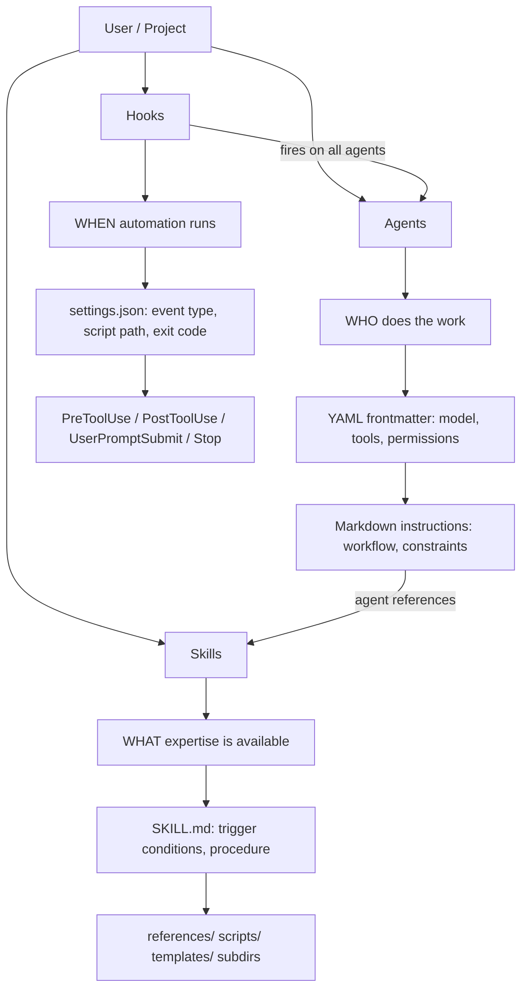

# Architecture: Extensibility

## Three-Layer Extension Model



## Agent Creation Workflow

```
1. User requests: "create an agent for X"
          │
          ▼
2. creating-claude-agents skill activates
          │
          ├─ Define purpose + responsibilities
          ├─ Set YAML frontmatter (name, description, tools[])
          ├─ Write workflow section (numbered steps)
          ├─ List skills referenced + constraints
          │
          ▼
3. Write .claude/agents/<name>/AGENT.md
          │
          ▼
4. Sync to .codex/ (automatic post-creation step)
          │
          ▼
5. system_docs_management agent creates README + USAGE_GUIDE
```

## Skill Creation Workflow

```
1. User requests: "create a skill for Y"
          │
          ▼
2. creating-claude-skills skill activates
          │
          ├─ Define trigger conditions (when should it load)
          ├─ Write YAML frontmatter (name, description)
          ├─ Structure with progressive disclosure:
          │     Level 1: Summary (always loaded)
          │     Level 2: Detail (loaded when relevant)
          │     Level 3: Reference (loaded on demand)
          ├─ Add reference files if needed
          │
          ▼
3. Write .claude/skills/<name>/SKILL.md
          │
          ▼
4. Sync to .codex/, create system docs
```

## Progressive Disclosure (3 Levels)

| Level | Content | Load Trigger |
|-------|---------|-------------|
| Summary | What the skill does, when to use | Always loaded with agent |
| Detail | Step-by-step procedure, examples | When task matches skill domain |
| Reference | Full spec, edge cases, error tables | When deep context needed |

## Hook Event Types

| Event | Fires When | Typical Use |
|-------|-----------|-------------|
| `PreToolUse` | Before any tool call | Validate, block dangerous operations |
| `PostToolUse` | After any tool call | Log, format, verify output |
| `UserPromptSubmit` | On every user message | Keyword detection, auto-inject context |
| `Stop` | Agent signals completion | Cleanup, sync operations |

## Error Handling

| Error | Trigger | Action |
|-------|---------|--------|
| Agent not activating | Trigger phrases not in skill description | Add explicit `when:` conditions to SKILL.md |
| Skill not loading | Missing YAML frontmatter `name` or `description` | Add required YAML fields |
| Hook script fails | Non-zero exit code from hook script | Logged; agent continues unless exit code 2 (blocking) |
| Post-creation sync fails | claude-codex sync error | Log; retry sync manually |
| Duplicate agent name | Agent already exists | Prompt user to rename or overwrite |
