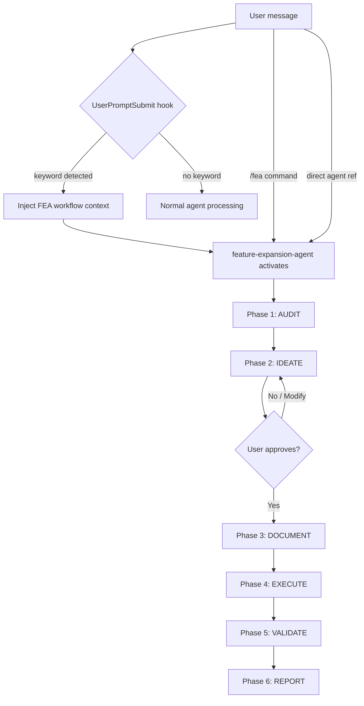

# Architecture: Feature Expansion

## Trigger Routing



## Phase Decision Logic

### Phase 1: AUDIT
- Query DB for NULL rates, empty tables, low-count fields
- Browse app pages for thin content or placeholders
- Test external API endpoints for available but un-ingested data
- Categorize: Data gaps / UI gaps / Interactivity gaps / Automation gaps

### Phase 2: IDEATE — Wait Gate
The agent **must not proceed to Phase 3 without explicit user approval**. This is the primary safety gate. Approval can be:
- "yes" / "go ahead" / "looks good" — approve all
- "do 1, 3, and 5" — approve specific items
- "skip X" — approve with exclusion
- "change Y to Z" — approve with modification

### Phase 4: EXECUTE — Build Order
Within each enhancement, the order is fixed:
1. Schema (ALTER TABLE or Drizzle migration)
2. Ingestion (CLI fetcher, add to `package.json` under `data:*`)
3. API (update backend routes)
4. Frontend (wire into existing pages)
5. Admin (register in adapter registry)

## Task Naming Convention

Each FEA session gets a letter series. The letter advances with each new session:

```
Session 1: G1, G2, G3...
Session 2: H1, H2, H3...
Session 3: I1, I2, I3...
```

Within a session, each task in the approved list gets the next number. This makes cross-session references unambiguous: "The navbar fix was K3."

## Component Interaction

```
/fea or keyword
      │
      ▼
fea-detect.sh (hook) ──────→ Injects SKILL.md content into context
      │
      ▼
feature-expansion-agent ───→ Reads SKILL.md for phase procedures
      │
      ├─ Phase 1-2 ─────────→ Chat interaction (no file writes)
      ├─ Phase 3 ───────────→ Updates .adr/orchestration/ notes + task list
      ├─ Phase 4 ───────────→ Schema, scripts, API, frontend, admin changes
      ├─ Phase 5 ───────────→ Playwright tests + screenshots
      └─ Phase 6 ───────────→ Chat report with metrics
```

## Error Handling

| Error | Trigger | Action |
|-------|---------|--------|
| Agent skips ideation gate | Specific request with /fea | Add "ideate first" to prompt; or /fea alone for broad audit |
| Hook not firing | Keyword missing or PostToolUse vs UserPromptSubmit | Check settings.json registration; verify keyword spelling |
| CLI script not in package.json | Agent forgets data:* prefix | Check package.json manually; add missing entry |
| Playwright test flaky | Race condition in E2E | Re-run; document as flaky in Phase 6 report |
| API endpoint missing | Backend route not updated | Phase 4 build order violation — add API step before frontend |
| No external data available | API returns empty | Document gap in Phase 6; skip ingestion for that source |
