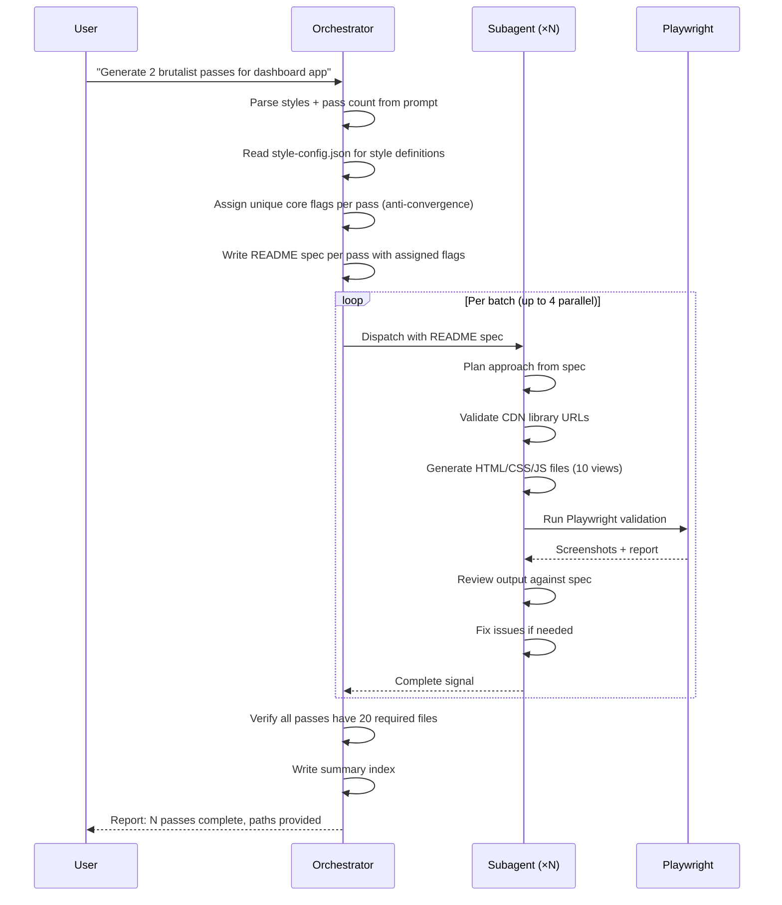

# Architecture: General Frontend Design

## Orchestrator → Subagent Flow



## Anti-Convergence System

The orchestrator assigns uniqueness flags to prevent passes within the same style group from looking alike:

**Orchestrator-assigned (structural — prevent layout duplication):**
- Layout archetype: sidebar-driven | full-bleed-immersive | dashboard-grid | editorial-column | card-mosaic
- Navigation model: persistent-left-rail | floating-fab-menu | hamburger-drawer | top-tabs | breadcrumb-tree
- Information density: minimal | balanced | data-rich
- Animation philosophy: static | subtle | expressive
- Color temperature: warm | cool | neutral | high-contrast

**Subagent-assigned (creative — within structural constraints):**
- Typography pairing, grid system, interaction signature, visual motif, spacing rhythm, micro-interaction style

## Output File Requirements (20 per pass)

```
.docs/planning/concepts/<style>/pass-<n>/
├── [view].html × 10        # One per app view
├── style.css               # Shared stylesheet
├── app.js                  # Shared JavaScript
├── README.md               # Updated with subagent flags
└── validation/
    ├── handoff.json                      # Structured handoff data
    ├── inspiration-crossreference.json   # Reference sites used
    ├── report.playwright.json            # Playwright test results
    ├── desktop/
    │   ├── showcase.png
    │   └── showcase-viewport.png
    └── mobile/
        ├── showcase.png
        └── showcase-viewport.png
```

## Subagent Self-Validation Loop

Each subagent runs its own validation cycle before reporting complete:

```
Generate → Validate (Playwright) → Review results → Fix issues → Re-validate → Done
```

Subagent does not mark complete until Playwright screenshots confirm visual output.

## Error Handling

| Error | Trigger | Action |
|-------|---------|--------|
| CDN library 404 | Validation fetches fail | Try alternate CDN; use local equivalent |
| Playwright screenshot blank | Rendering error | Check browser console, fix JS errors |
| Pass convergence detected | Two passes share layout archetype | Reassign orchestrator flags before dispatch |
| Missing required files | Pass has <20 files at completion | Orchestrator flags pass as incomplete |
| Subagent exceeds context | Very large pass with many files | Split into two subagent calls |
