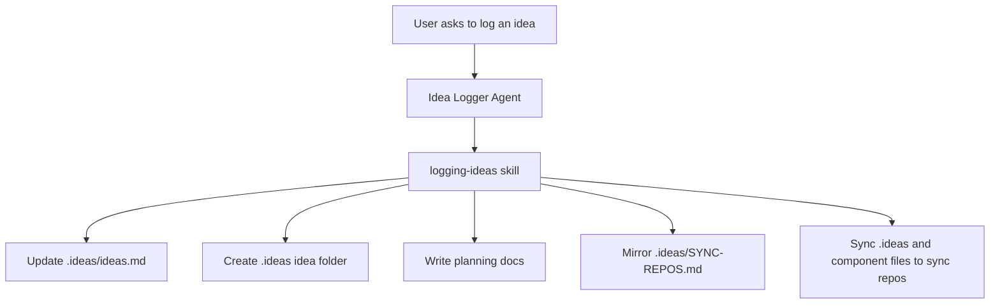

# Idea Logging Architecture

## Component Flow

## Boundaries

- The agent owns execution flow and reporting.
- The skill defines conventions and trigger conditions.
- The `.ideas/` folder stores business content.
- `SYNC-REPOS.md` defines propagation targets.

## Design Notes

- The system is intentionally file-based so ideas remain portable and inspectable.
- The idea folder uses repo-setup planning conventions to keep ideation and planning structurally aligned.
- Sync includes the supporting component itself so idea logging behavior remains consistent across repos.
