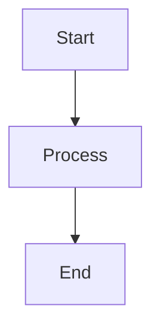

# Mermaid — Usage Guide

## Quick Start

### Add a diagram to a doc
Just write a fenced Mermaid block:
````markdown

````
VS Code and GitHub render it automatically. No CLI needed.

### Use the command
```
/mermaid add flowchart    # insert a flowchart template
/mermaid validate         # check all recent Mermaid blocks
/mermaid render file.mmd  # render to SVG via mmdc
```

### Auto-suggestions
When you write a system doc, architecture file, or ADR doc that describes a flow or process, the hook will suggest adding a diagram. Non-blocking — just a suggestion.

## When to Use Which Diagram

| Scenario | Diagram Type |
|---|---|
| Component flow (A→B→C) | `flowchart TD` |
| Agent↔subagent interaction | `sequenceDiagram` |
| Status transitions | `stateDiagram-v2` |
| Data model relationships | `erDiagram` |
| Timeline/phases | `gantt` or `timeline` |
| Decision tree | `flowchart TD` with `{}` decision nodes |

## Troubleshooting
**Diagram not rendering in VS Code:** Install "Markdown Preview Mermaid Support" extension.
**Syntax error:** Run `/mermaid validate` to check all blocks.
**Need static image:** Run `/mermaid render file.mmd` to generate SVG via mmdc.
