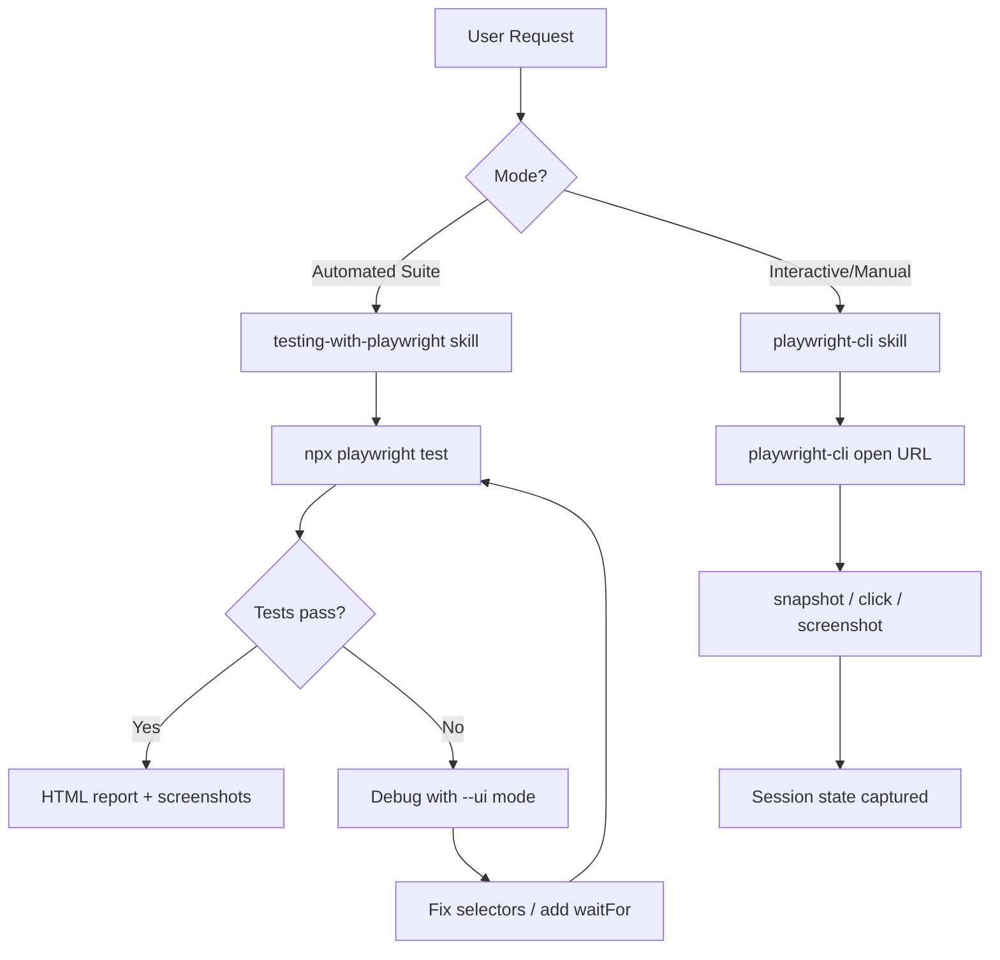

# Playwright Testing — Architecture

## Component Map

```
.claude/
  agents/
    playwright-testing-agent/AGENT.md   — Orchestrates test authoring + CLI automation
  skills/
    testing-with-playwright/SKILL.md    — E2E test suite guidance (npx playwright test)
    playwright-cli/SKILL.md             — Interactive CLI browser automation
```

## Two-Mode Architecture



## Agent Execution Order

1. Agent receives test request
2. Selects mode: suite (testing-with-playwright) or CLI (playwright-cli)
3. **Suite mode**: writes spec files → runs `npx playwright test` → reviews HTML report → fixes failures → re-runs
4. **CLI mode**: opens browser session → issues commands → captures snapshots → closes

## Selector Preference Hierarchy

```
getByRole()        — highest priority (accessibility-aligned)
getByLabel()       — form inputs
getByText()        — visible text
getByTestId()      — data-testid attributes
CSS / XPath        — last resort only
```

## Visual Regression Flow

```
First run:   test() → toHaveScreenshot() → baseline PNG written
Re-run:      test() → toHaveScreenshot() → diff against baseline
Diff > threshold? → FAIL + diff image generated
Fix:         delete baseline PNG → re-run to regenerate
```

## Error Handling

| Error | Cause | Resolution |
|-------|-------|------------|
| Timeout / element not found | Dynamic content not awaited | Add `waitFor()` or `waitForLoadState()` |
| Visual regression false positive | Font/render jitter | Delete baseline PNGs, regenerate |
| CI flakiness | Parallel workers race | Set `retries: 2`, `workers: 1` in playwright.config.ts |
| Blank screenshots | Page not settled | Add `waitForLoadState('networkidle')` |

## Key Files

| File | Purpose |
|------|---------|
| `playwright.config.ts` | Browser projects, retries, reporter, base URL |
| `tests/*.spec.ts` | Test specs |
| `test-results/` | HTML report output |
| `user_stories/*/validation/*.png` | Story evidence screenshots |
