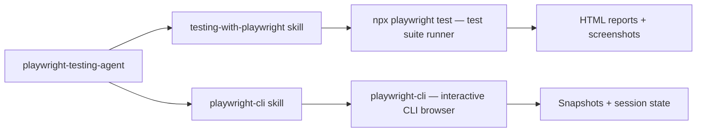

# System Docs: Playwright Testing

## Overview

Provides E2E test authoring, visual regression testing, and browser automation for web applications. Covers the full stack: test writing, Page Object Model, fixtures, API testing, and CI/CD integration.

## Components

| Component | Path |
|-----------|------|
| Agent | `.claude/agents/playwright-testing-agent/AGENT.md` |
| Skill (E2E testing) | `.claude/skills/testing-with-playwright/SKILL.md` |
| Skill (CLI automation) | `.claude/skills/playwright-cli/SKILL.md` |

## Architecture



## Two Modes

| Mode | Tool | Use Case |
|------|------|----------|
| Test Suite | `testing-with-playwright` | Automated E2E suites, CI/CD, visual regression |
| Interactive CLI | `playwright-cli` | Research, manual automation, one-off scraping |

## How to Use

```
/agent playwright-testing-agent "Write E2E tests for the login flow"
/skill testing-with-playwright   (for guidance while writing tests)
/skill playwright-cli            (for CLI browser commands)
```

## Integration Points

- **user_story_testing** — Uses Playwright to capture evidence screenshots for each story
- **research** — `playwright-cli` and `researching-with-playwright` underpin web research
- **user_docs** — Playwright captures screenshots for visual documentation
- **hooks_system** — Hooks can trigger Playwright tests on code changes
