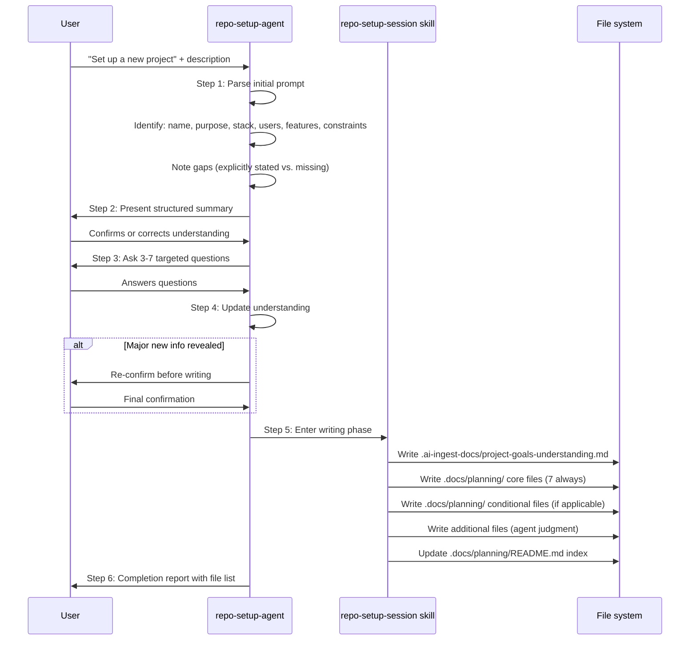

# Architecture: Repo Setup

## Conversational Discovery Flow



## Writing Phase Decision Tree

```
For each planning doc:
    │
    ├─ Core (always write): overview.md, prd.md, technical-specification.md,
    │                       user-stories.md, milestones.md, risks-and-decisions.md,
    │                       README.md
    │
    ├─ Conditional (write if applicable):
    │   ├─ Has auth or billing?  → auth-and-subscriptions.md
    │   ├─ Deployment known?     → deployment-and-hosting.md
    │   ├─ Defined folder schema?→ project-structure-spec.md
    │   └─ Multi-device sync?    → sync-strategy.md
    │
    └─ Additional (agent judgment):
        If complexity warrants → api-design.md, data-model.md, security-model.md
```

## Output Structure

```
.ai-ingest-docs/
└── project-goals-understanding.md    # AI memory: identity, purpose, users, stack

.docs/planning/
├── README.md                         # Index of all planning docs
├── overview.md                       # Vision + scope
├── prd.md                            # Full product requirements
├── technical-specification.md        # Architecture + infrastructure
├── user-stories.md                   # Stories with acceptance criteria
├── milestones.md                     # Phased delivery plan
├── risks-and-decisions.md            # Risk log + ADRs
└── [conditional files as applicable]
```

## Clarifying Question Categories

Agent selects from these question categories based on what was missing from the initial description:

1. Users and technical level
2. Authentication strategy
3. Core data entities and storage
4. Deployment targets
5. Third-party integrations
6. Scale expectations
7. Team structure
8. Timeline and deadlines
9. Non-goals and constraints
10. Existing work vs. greenfield

## Safety Gates

- Never write files before user confirms understanding (Step 2)
- Never write files before user answers questions (Steps 3-4)
- Never overwrite non-template content without warning
- Use `[TBD — needs input]` for genuinely unknown details (never invent)

## Error Handling

| Error | Trigger | Action |
|-------|---------|--------|
| User provides minimal description | 1-sentence project brief | Ask all relevant categories |
| User skips clarifying answers | "just proceed" | Flag unknowns with [TBD] placeholders |
| Planning doc already exists | Non-empty file at target path | Warn before overwriting |
| Tech stack unknown | Not stated or implied | Ask explicitly before writing tech spec |
| Conflicting requirements | User states contradictions | Highlight in risks-and-decisions.md |
