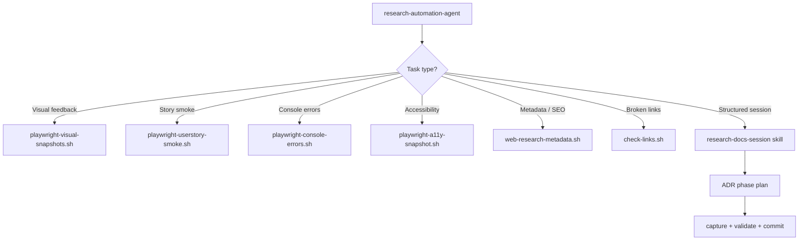

# Research — Architecture

## Component Map

```
.claude/
  agents/
    research-automation-agent/AGENT.md   — Dispatches hook scripts, runs research sessions
  skills/
    researching-with-playwright/SKILL.md — Browser automation for web data extraction
    research-docs-session/SKILL.md       — ADR-tracked structured research sessions
  hooks/
    scripts/
      playwright-visual-snapshots.sh     — Multi-viewport screenshots
      playwright-userstory-smoke.sh      — User story smoke screenshots from CSV
      playwright-console-errors.sh       — Console/page error capture
      playwright-a11y-snapshot.sh        — Accessibility tree snapshots
      web-research-metadata.sh           — Page metadata / SEO extraction
      check-links.sh                     — URL status (200 / broken) checks
```

## Task Routing



## Input File Conventions

| Script | Input | Format |
|--------|-------|--------|
| `playwright-visual-snapshots.sh` | `urls.txt` | One URL per line |
| `playwright-userstory-smoke.sh` | `stories.csv` | `story_id,url,description` |
| `check-links.sh` | `urls.txt` | One URL per line |
| All others | `urls.txt` or direct args | — |

## Structured Research Session Flow

```
/skill research-docs-session
  │
  ├─ 1. Create phase plan in .adr/current/<SESSION>/phase_N.md
  ├─ 2. Capture URLs/sources with playwright or fetch
  ├─ 3. Extract structured data
  ├─ 4. Validate citations / cross-reference sources
  ├─ 5. Archive phase: move plan to history/
  └─ 6. Commit all artifacts
```

## Data Extraction Pattern

```typescript
// Generic extraction pattern used by researching-with-playwright skill
const browser = await chromium.launch();
const page = await browser.newPage();
await page.goto(url);
await page.waitForLoadState('networkidle');
const data = await page.locator(selector).allTextContents();
await page.screenshot({ path: outputPath, fullPage: true });
await browser.close();
```

## Error Handling

| Error | Resolution |
|-------|------------|
| No output from hook script | Verify `urls.txt` exists at repo root with valid URLs |
| Playwright not installed | `npm init playwright@latest && npx playwright install` |
| Blank screenshots | Add `waitForLoadState('networkidle')` before capture |
| Stale CSV data | Re-export `stories.csv` from `user_stories/user_stories.md` |

## Key Integration: ADR Archival

`research-docs-session` writes phase plans and reviews into `.adr/` — making research
sessions first-class citizens of the project's audit trail alongside feature sessions.
