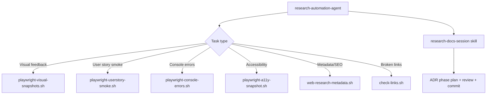

# System Docs: Research

## Overview

Automates web research, data extraction, visual feedback capture, and structured documentation sessions using Playwright browser automation and ADR orchestration.

## Components

| Component | Path |
|-----------|------|
| Agent | `.claude/agents/research-automation-agent/AGENT.md` |
| Skill (browser automation) | `.claude/skills/researching-with-playwright/SKILL.md` |
| Skill (session structure) | `.claude/skills/research-docs-session/SKILL.md` |
| Hook scripts | `.claude/hooks/scripts/` |

## Architecture



## Available Hook Scripts

| Script | Purpose |
|--------|---------|
| `playwright-visual-snapshots.sh` | Multi-viewport page screenshots |
| `playwright-userstory-smoke.sh` | User story smoke screenshots from CSV |
| `playwright-console-errors.sh` | Capture console/page errors |
| `playwright-a11y-snapshot.sh` | Accessibility tree snapshots |
| `web-research-metadata.sh` | Page metadata / SEO extraction |
| `check-links.sh` | URL status checks |

## How to Use

```
/agent research-automation-agent "Take visual snapshots of all pages at mobile and desktop viewports"
/agent research-automation-agent "Check for console errors on https://example.com"
```

Prepare input files first: `urls.txt` (list of URLs) or `stories.csv` (user stories).

## Integration Points

- **playwright_testing** — Shares Playwright infrastructure
- **adr_setup** — `research-docs-session` creates phase plans and archives in `.adr/`
- **user_story_testing** — Smoke screenshots feed into story validation evidence
