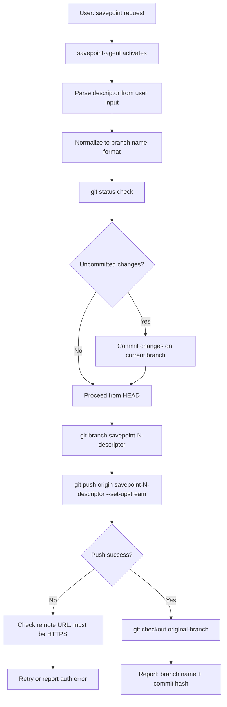

# Architecture: Savepoint

## Savepoint Creation Flow



## Name Normalization Algorithm

User input is normalized to `savepoint-<descriptor>` format:

```
Input: "savepoint 1 - auth complete"
       ↓ lowercase
       "savepoint 1 - auth complete"
       ↓ replace spaces with hyphens
       "savepoint-1---auth-complete"
       ↓ collapse multiple hyphens
       "savepoint-1-auth-complete"

Input: "milestone after phase 3"
       ↓ no "savepoint" prefix → prepend
       "savepoint-milestone-after-phase-3"
```

## Branch State After Savepoint

```
Before:
  main (HEAD) ──── commit-A ──── commit-B

After:
  main (HEAD) ──── commit-A ──── commit-B
  savepoint-1-auth-complete ────────────┘
  (same commit, different branch pointer)
```

The savepoint branch is a lightweight ref pointing to the same commit. No files are duplicated.

## Restore Patterns

| Goal | Command |
|------|---------|
| Inspect savepoint state | `git checkout savepoint-1-auth-complete` |
| New branch from savepoint | `git checkout -b recovery savepoint-1-auth-complete` |
| Hard reset main to savepoint | `git reset --hard savepoint-1-auth-complete` (destructive) |
| Cherry-pick from savepoint | `git cherry-pick <commit-hash>` |

## Integration Trigger Points

Savepoints are naturally created at:
- Phase completion in adr_setup
- Session boundaries in session_orchestration
- User-requested checkpoints mid-session

## Error Handling

| Error | Trigger | Action |
|-------|---------|--------|
| Push auth error | SSH remote or expired credential | Verify HTTPS remote; update with `git remote set-url` |
| Branch name conflict | `savepoint-1-auth-complete` already exists | Suggest suffix: `savepoint-1b-auth-hotfix` |
| Uncommitted wrong files | Agent stages everything with `git add .` | User should pre-stage specific files; agent warns |
| Detached HEAD after checkout | User ran git commands between steps | Run `git checkout main` or target branch first |
| Remote not set | Fresh local repo with no origin | Prompt user to add remote before savepoint |
