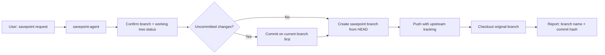

# System Docs: Savepoint

## Overview

Creates named savepoint branches from the current commit state and pushes them to remote. After creation, automatically returns to the original working branch. Provides reproducible snapshots for milestone rollback points.

## Components

| Component | Path |
|-----------|------|
| Agent | `.claude/agents/savepoint-agent/AGENT.md` |
| Skill | `.claude/skills/savepoint-branching/SKILL.md` |

## Architecture



## Naming Convention

Format: `savepoint-<number>-<descriptor>`

User input is normalized automatically:
- `"savepoint 1 - auth complete"` → `savepoint-1-auth-complete`
- `"milestone after phase 3"` → `savepoint-milestone-after-phase-3`

## How to Use

```
/agent savepoint-agent "Create savepoint 1 - initial schema complete"
```

Or via skill:
```
/skill savepoint-branching
```

Then describe the milestone.

## Integration Points

- **adr_setup** — Natural savepoint trigger: after each phase completes, create a savepoint
- **session_orchestration** — Orchestrators create savepoints at session boundaries
- **version_control** — Relies on the repo's configured HTTPS remote (never hardcoded)
