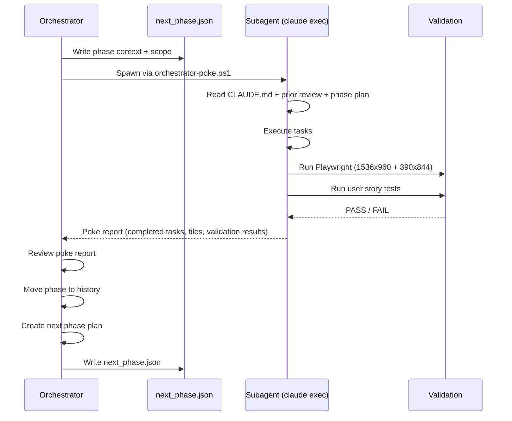

# Session Orchestration — Architecture

## Component Map

```
.claude/
  agents/
    longrunning-orchestrator-agent/AGENT.md    — Drives the phase loop
    longrunning-worker-subagent/AGENT.md       — Executes a single phase
    research-docs-agent/AGENT.md               — Research variant orchestrator
  skills/
    longrunning-session/SKILL.md               — Validation-enforcing session variant
    orchestrator-session/SKILL.md              — Loop management + subagent dispatch
    research-docs-session/SKILL.md             — ADR-tracked research variant
  hooks/
    scripts/orchestrator-poke.ps1              — Spawns subagent via claude exec
  orchestration/
    queue/next_phase.json                      — Handoff state between phases
```

## Orchestrator / Subagent Topology



## 11-Step Phase Lifecycle

```
1  Ensure session folder exists
2  Create/update PTL, PRD, tech requirements, notes
3  Write phase_N.md in current/
4  Read project conventions (MANDATORY before any work)
5  Execute tasks
6  Validate: Playwright PNGs + user story tests + pnpm typecheck
7  Write phase_N_review.md to history/
8  Move phase_N.md to history/
9  Check off phase in primary_task_list.md
10 Commit + push (HTTPS)
11 Create next phase plan
```

## Validation Requirements (Step 6)

| Check | Requirement |
|-------|-------------|
| UI screenshots | PNG, desktop 1536x960 + mobile 390x844 @2x |
| User story tests | Against live app + real DB — mocks insufficient |
| User story report | `.docs/validation/<SESSION>/<PHASE>/user-story-report.md` |
| Type check | `pnpm typecheck` — zero errors |
| Unit tests | `pnpm test` — zero failures |
| ALL stories | Must PASS before phase marked complete |

## Queue File Schema (next_phase.json)

```json
{
  "session": "3_FRONTEND_DEVELOPMENT",
  "phase": 2,
  "scope": "Implement school profile page",
  "context_files": ["CLAUDE.md", ".adr/orchestration/.../phase_1_review.md"],
  "validation_required": true
}
```

## ADR Directory Layout

```
.adr/
  orchestration/<SESSION>/
    primary_task_list.md    — master phase checklist
    prd.md
    technical_requirements.md
    notes.md
  current/<SESSION>/
    phase_N.md              — active plan (Step 3)
  history/<SESSION>/
    phase_N.md              — archived plan (Step 8)
    phase_N_review.md       — review (Step 7)
```

## Three Session Variants

| Variant | Skill | Key Difference |
|---------|-------|---------------|
| Longrunning | `longrunning-session` | Strictest validation enforcement |
| Orchestrator | `orchestrator-session` | Loop management + multi-phase dispatch |
| Research-docs | `research-docs-session` | ADR-tracked research, citation validation |

## Error Handling

| Problem | Resolution |
|---------|-----------|
| Phase stuck `in_progress` | Check `.adr/current/` — manually move to history if subagent crashed |
| Subagent ignores spec | Use `--orchestrated` mode with chain validation feedback loops |
| Validation fails | Never force pass — fix code, retest, document root cause in review |
| Poke hook not triggering | Check `orchestrator-poke.ps1` path and `claude exec` availability |
