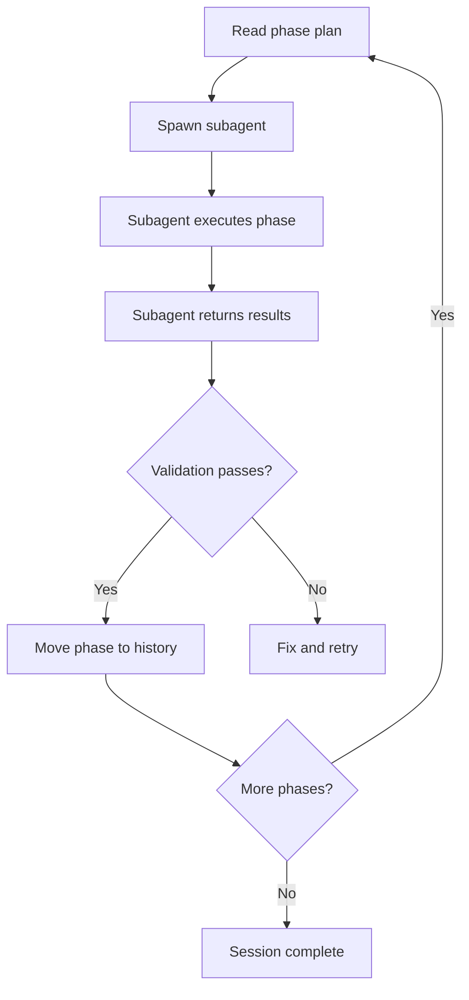

# Session Orchestration — Usage Guide

## Quick Start

### Start a Long-Running Session
```
"start a longrunning session for frontend development"
```
The orchestrator creates a phase plan, validates against ADR task lists, and dispatches subagents per phase.

### Run the Orchestrator Loop
```
"run the orchestrator loop for session 3"
```
Reads the phase plan, spawns a subagent for the current phase, collects results, advances to next.

## How It Works



## Key Components
- **Orchestrator skill** (`orchestrator-session`): manages the loop
- **Longrunning skill** (`longrunning-session`): enforces validation (Playwright, user stories)
- **Orchestrator poke** (`orchestrator-poke.ps1`): spawns `claude exec` subagents
- **Queue file** (`.claude/orchestration/queue/next_phase.json`): handoff state

## Phase Lifecycle
1. Phase plan created in `.adr/current/<SESSION>/phase_N.md`
2. Subagent executes the phase
3. Playwright screenshots captured to `.docs/validation/`
4. Phase review written to `.adr/history/<SESSION>/phase_N_review.md`
5. Phase plan moved to history
6. Next phase created

## Validation Policy (Mandatory)
- Playwright PNG screenshots of all UI surfaces (desktop + mobile)
- User story tests against the live running app
- User story report with PASS/FAIL per story
- ALL stories must pass before phase completion

## Troubleshooting
**Subagent doesn't follow the spec:** Use `--orchestrated` mode with the chain system for validation feedback loops.
**Phase stuck in_progress:** Check `.adr/current/` for the phase file. Manually move to history if subagent crashed.
