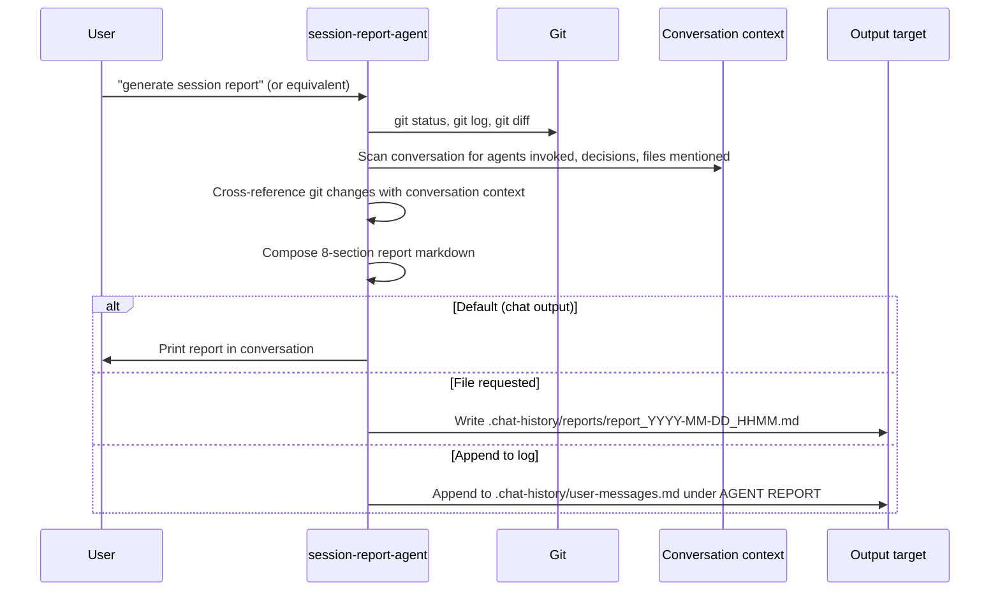

# Architecture: Session Reports

## Generation Flow



## 8-Section Report Structure

| # | Section | Source | Required |
|---|---------|--------|----------|
| 1 | Session Summary | Agent judgment | Yes |
| 2 | Files Modified | `git status` + `git diff` | Yes |
| 3 | Agents Invoked | Conversation scan | Yes |
| 4 | Key Decisions | Conversation scan | Yes |
| 5 | Systems Affected | Files modified → system map | Yes |
| 6 | Sync Status | `.codex` mirror, remote push state | Yes |
| 7 | Pending Items | Unresolved TODOs from conversation | Yes |
| 8 | Metrics | git log, file counts, timing estimate | Yes |

## Data Gathering Algorithm

1. `git status` → identifies staged/unstaged/untracked files
2. `git log --oneline -20` → recent commits and their messages
3. `git diff HEAD~1..HEAD` (or similar) → file-level change details
4. Conversation analysis → extract agent names, skill names, decisions, file mentions
5. Cross-reference: match git changes to conversation events to build reasoning column in Files Modified table

## Output Routing Decision Tree

```
User requests report
        │
        ├─ "save" / "to file" ─────────→ Write to .chat-history/reports/
        │
        ├─ "add to log" / "append" ────→ Append to user-messages.md
        │
        └─ Default ────────────────────→ Print in chat
```

## Timing Estimate Heuristic

Duration is estimated from commit timestamps when available. If no commits exist in the session, estimate from conversation length (~1 message/min average).

## Error Handling

| Error | Trigger | Action |
|-------|---------|--------|
| No git commits in session | Brand new branch or no commits | Report file changes from `git status` only, note "no commits" |
| No agents invoked | Purely conversational session | Section 3: "No agents dispatched" |
| Unknown file in diff | File not mentioned in conversation | List in Files Modified with reasoning "direct edit" |
| Output file write fails | Permissions or path error | Fall back to printing in chat |
| No pending items | Everything completed | Section 7: "No pending items — all work complete" |
