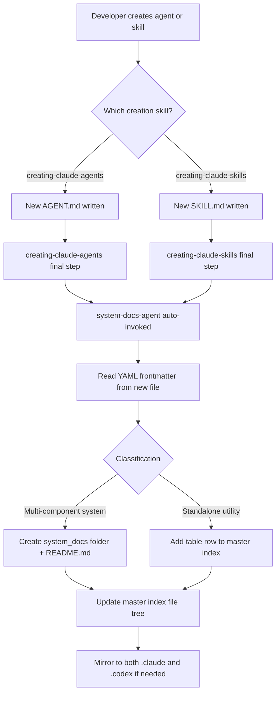

# System Docs Management — Architecture

## Component Map

```
.claude/
  agents/
    system-docs-agent/AGENT.md        — Documentation maintainer / index updater
  skills/
    system-docs-agent/SKILL.md        — Invocation guide and classification rules
  hooks/
    (auto-invoked from creating-claude-agents and creating-claude-skills skills)
.codex/
  system_docs/
    README.md                         — Master index (file tree + tables)
    <system-name>/
      README.md                       — System-level overview
      ARCHITECTURE.md                 — (this pattern)
      SYSTEM_OVERVIEW.md              — (this pattern)
      USAGE_GUIDE.md
```

## Auto-Invocation Flow



## Classification Decision Logic

```
New component created
  │
  ├─ Has paired agent + skill?       → Folder
  ├─ Has resources/ subdirectory?    → Folder
  ├─ Is orchestrator/subagent pair?  → Folder
  ├─ Has related hook scripts?       → Folder
  │
  └─ Single SKILL.md, no resources   → Table row in master index
```

## Master Index Structure

```
.codex/system_docs/README.md
  │
  ├── ## File Tree          — visual ASCII tree of all system folders
  ├── ## Skills Not Mapped  — table for standalone utility skills
  └── ## System Overview    — summary table: system / components / purpose
```

## Agent Processing Pipeline

```
1. Read new AGENT.md or SKILL.md
2. Extract YAML frontmatter: name, description, tags
3. Apply classification logic (folder vs table row)
4. If folder: check for existing system_docs/<name>/ directory
   ├─ Exists → update README.md
   └─ Missing → create directory + README.md from template
5. Rebuild master index file tree (scan filesystem)
6. Update or insert table row in appropriate section
7. Mirror to .codex/system_docs/ if applicable
```

## Error Handling

| Problem | Resolution |
|---------|-----------|
| Agent not appearing in index | Check AGENT.md has valid `name:` frontmatter field |
| system_docs folder sparse | Ensure source file has both `name:` and `description:` fields |
| Index stale after bulk file moves | Run manual refresh; agent re-indexes from filesystem |
| Deprecation target not found | Agent searches by name match, not path — provide exact name |
