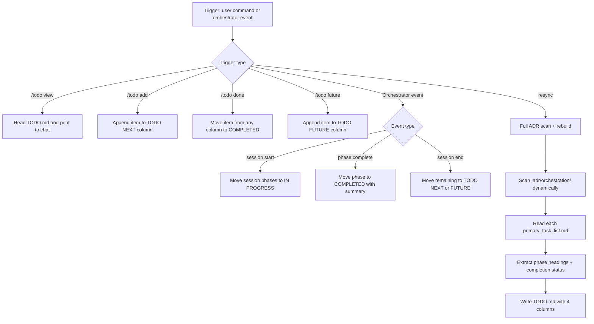

# Architecture: TODO Tracker

## Update Flow



## ADR Discovery Algorithm

When resyncing with `.adr/orchestration/`:

```
1. List all subdirectories in .adr/orchestration/
   (dynamic — never hardcoded session names)

2. For each session folder:
   a. Read primary_task_list.md
   b. Extract: ## Phase N — <title> headings
   c. Count [x] vs [ ] checkboxes under each phase heading
   d. Determine column:
      - All [x] → COMPLETED
      - Some [x], some [ ] → IN PROGRESS
      - No [x] → TODO NEXT

3. Write one line per phase into appropriate column
4. Group by session with a heading (## Session N)
5. Include link to primary_task_list.md for drill-down
```

## TODO.md Column Semantics

| Column | Checkbox | Semantics |
|--------|----------|-----------|
| IN PROGRESS | `- [ ]` | Actively being worked on right now |
| TODO NEXT | `- [ ]` | Next work cycle — prioritized and ready |
| COMPLETED | `- [x]` | Done — grouped by theme or session |
| TODO FUTURE | `- [ ]` | Deferred, nice-to-have, or blocked on external |

## Item Format Rules

- One line per item (no sub-bullets in TODO.md)
- Verb-first imperative phrasing: "Add auth flow", "Fix enrollment chart"
- No implementation details — deep context lives in ADR docs
- Phase items include a session reference: "Phase 2 — Auth flow [→ task list](path)"

## Orchestrator Integration Events

| Event | TODO.md Action |
|-------|---------------|
| Session start | Move session phases from TODO NEXT → IN PROGRESS |
| Phase complete | Move phase from IN PROGRESS → COMPLETED with one-line summary |
| Session end (partial) | Move unstarted phases from IN PROGRESS → TODO NEXT |
| New planning decision | Add to TODO NEXT (ad-hoc item) |

## Error Handling

| Error | Trigger | Action |
|-------|---------|--------|
| TODO.md missing | First run or deleted | Create with empty 4-column template |
| ADR session missing primary_task_list.md | Incomplete session folder | Skip that session, log warning |
| Wrong column for a phase | Phase status field vs checkbox mismatch | Read checkboxes as ground truth |
| Too many IN PROGRESS items | Multiple concurrent sessions | Move completed to COMPLETED, defer rest to TODO NEXT |
| Orphaned items | Manual edits broke column format | Re-parse by `## ` heading delimiters |
