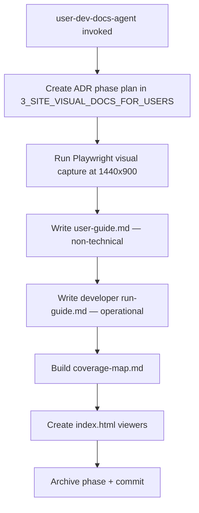

# User Docs — Architecture

## Component Map

```
.claude/
  agents/
    user-dev-docs-agent/AGENT.md           — Drives the full doc generation workflow
  skills/
    producing-visual-docs/SKILL.md         — Visual capture + doc writing guidance
.appdocs/
  user/
    user-guide.md                          — Non-technical step-by-step guide
    coverage-map.md                        — What's documented vs. what's missing
    index.html                             — HTML viewer for user docs
    screenshots/
      NN-<description>-<viewport>.png      — Playwright-captured visuals
  developer/
    run-guide.md                           — Setup, env vars, operational commands
    index.html                             — HTML viewer for developer docs
```

## Agent Workflow



## Playwright Capture Spec

```typescript
// tests/visual-capture.spec.ts
test('capture homepage', async ({ page }) => {
  await page.setViewportSize({ width: 1440, height: 900 });
  await page.goto('http://localhost:3000');
  await page.waitForLoadState('networkidle');
  await page.screenshot({
    path: '.appdocs/user/screenshots/01-homepage.png',
    fullPage: true
  });
});
```

- Viewport: **1440x900** (documentation standard, differs from 1536x960 used in phase validation)
- Format: PNG, full-page
- Naming: `NN-description.png` (two-digit prefix for sort order)

## Screenshot Naming Convention

```
01-landing-desktop.png     — landing page
02-login-form.png          — auth flow
03-dashboard-overview.png  — main user surface
...
```

## Content Depth Requirements

| Doc | Depth Requirement |
|-----|-----------------|
| `user-guide.md` | Non-technical, step-by-step, no code |
| `run-guide.md` | Exact commands, env var names, operational flows — no summaries |
| `coverage-map.md` | Every feature listed: documented / not documented / in-progress |

## Error Handling

| Problem | Resolution |
|---------|-----------|
| `index.html` shows blank page | Check fetch paths — screenshots must be in `screenshots/` subdirectory |
| Screenshots captured before page loads | Add `waitForLoadState('networkidle')` before `page.screenshot()` |
| Developer docs too shallow | Skill requires exact commands + env vars; regenerate with explicit instruction |
| Coverage map missing entries | Agent scans user stories and compares against documented features |
