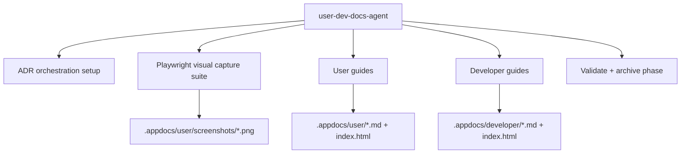

# System Docs: User Docs

## Overview

Produces user-facing and developer-facing documentation with Playwright screenshot capture, coverage maps, and lightweight HTML viewers. Maintains the `.appdocs/` directory structure with guides readable by non-technical users and step-by-step operational docs for developers.

## Components

| Component | Path |
|-----------|------|
| Agent | `.claude/agents/user-dev-docs-agent/AGENT.md` |
| Skill | `.claude/skills/producing-visual-docs/SKILL.md` |
| Output (user) | `.appdocs/user/` |
| Output (developer) | `.appdocs/developer/` |

## Architecture



## Required Outputs

| Path | Purpose |
|------|---------|
| `.appdocs/user/coverage-map.md` | What's documented vs. not |
| `.appdocs/user/user-guide.md` | Main user-facing guide |
| `.appdocs/user/screenshots/` | Playwright-captured visuals |
| `.appdocs/user/index.html` | HTML viewer |
| `.appdocs/developer/run-guide.md` | Setup and run commands |
| `.appdocs/developer/index.html` | Developer HTML viewer |

## How to Use

```
/agent user-dev-docs-agent "Create user and developer docs for the current app state"
```

## Integration Points

- **playwright_testing** — Captures screenshots at 1440x900 for visual docs
- **adr_setup** — Uses session `3_SITE_VISUAL_DOCS_FOR_USERS` for phase tracking
- **user_story_testing** — Story validation screenshots can be included in user docs
