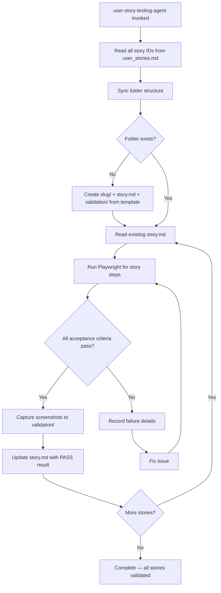

# User Story Testing — Architecture

## Component Map

```
.claude/
  agents/
    user-story-testing-agent/AGENT.md            — Orchestrates full validation pass
  skills/
    testing-user-stories-validation/SKILL.md     — Validation rules + screenshot policy
  templates/
    user-story-validation/story.md               — Story file template
user_stories/
  user_stories.md                                — Master story list (source of truth)
  <story-slug>/
    story.md                                     — Steps + acceptance criteria
    validation/
      NN-<description>.png                       — Playwright evidence screenshots
```

## Validation Flow



## Story File Format

```markdown
# Story: <Title>

## Steps
1. Navigate to ...
2. Click ...
3. Assert ...

## Acceptance Criteria
- [ ] <criterion>
- [ ] <criterion>

## Validation Result
- Status: PASS | FAIL
- Screenshots: validation/30-*.png
```

## Screenshot Naming Convention

Screenshots use numeric prefixes aligned to story steps (30+ to avoid collision with
system-level screenshots):

```
validation/
  30-search-results.png       — step 1 result
  31-filter-applied.png       — step 2 result
  32-details-page.png         — step 3 result
```

## Failure Handling Policy

```
Story FAILS
  │
  ├─ Record failure: reason, screenshot of failure state
  ├─ Investigate root cause (not a workaround)
  ├─ Fix the application code
  ├─ Rerun Playwright for that story
  └─ Only mark PASS when Playwright confirms
```

**Never mark a story passing unless Playwright confirms it.**

## Integration with ADR Sessions

- Session `5_USER_STORY_TESTING` — initial validation pass
- Session `7_USER_STORY_TESTING_RERUN` — re-validation after hardening

## Error Handling

| Problem | Resolution |
|---------|-----------|
| Missing story folder | Agent creates it from template at `.claude/templates/user-story-validation/story.md` |
| Story marked PASS without evidence | Prohibited by skill — re-run with explicit instruction |
| Screenshots in wrong path | All screenshots must be under `user_stories/<slug>/validation/` |
| Story list out of sync | Agent re-reads `user_stories.md` and reconciles folder structure |
