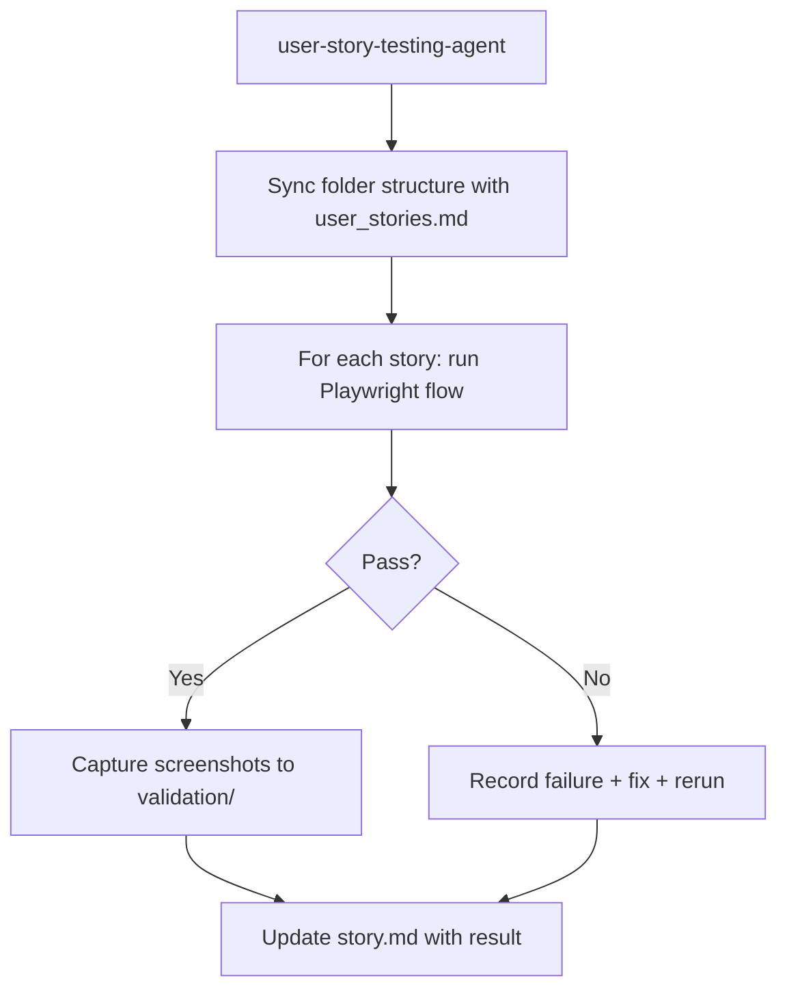

# System Docs: User Story Testing

## Overview

Validates every user story end-to-end with Playwright, captures screenshot evidence at critical steps, and documents pass/fail outcomes. Ensures all stories in `user_stories/user_stories.md` have matching folder structures with evidence.

## Components

| Component | Path |
|-----------|------|
| Agent | `.claude/agents/user-story-testing-agent/AGENT.md` |
| Skill | `.claude/skills/testing-user-stories-validation/SKILL.md` |
| Story list | `user_stories/user_stories.md` |
| Story folders | `user_stories/<story_slug>/` |
| Templates | `.claude/templates/user-story-validation/` |

## Architecture



## Story Folder Structure

```
user_stories/
├── user_stories.md           # Master list of all stories
└── <story_slug>/
    ├── story.md              # Steps + acceptance criteria
    └── validation/
        ├── screenshots (*.png)
        └── notes
```

## How to Use

```
/agent user-story-testing-agent "Run full validation pass for all user stories"
/agent user-story-testing-agent "Validate only us-005-login-flow"
```

## Integration Points

- **playwright_testing** — Core test runner and screenshot capture
- **adr_setup** — User story testing corresponds to ADR sessions `5_USER_STORY_TESTING` and `7_USER_STORY_TESTING_RERUN`
- **research** — Visual snapshot hooks can supplement story evidence
