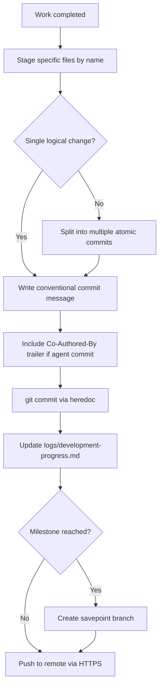

# Version Control — Architecture

## Component Map

```
.claude/
  agents/
    git-workflow-agent/AGENT.md        — Day-to-day commit discipline
    savepoint-agent/AGENT.md           — Milestone snapshot branches
  skills/
    managing-git-workflows/SKILL.md    — Atomic commits, conventional messages, push rules
    savepoint-branching/SKILL.md       — Named savepoint branch creation + guardrails
logs/
  development-progress.md             — Running commit log (updated after every commit)
```

## Commit Workflow



## Conventional Commit Message Format

```
<type>[optional scope]: <subject>

<body (optional)>

Co-Authored-By: Claude <model> <noreply@anthropic.com>
```

| Type | Purpose |
|------|---------|
| `feat` | New feature |
| `fix` | Bug fix |
| `docs` | Documentation only |
| `style` | Formatting / whitespace |
| `refactor` | No feature / no fix |
| `perf` | Performance improvement |
| `test` | Test additions or updates |
| `chore` | Build, deps, tooling |

## Savepoint Branching

```
Milestone reached (e.g., session complete, pre-deployment)
  │
  ├─ /savepoint or /skill savepoint-branching
  ├─ Branch name: savepoint/<descriptor>  (e.g., savepoint/session-3-complete)
  ├─ git checkout -b savepoint/<name>
  ├─ git push origin savepoint/<name>
  └─ Return to main — savepoint is a reference, not a working branch
```

## Progress Log Update Format

```markdown
### Commit #N: <subject>
**Date**: YYYY-MM-DD
**Status**: Complete

#### Work Completed:
- Item 1
- Item 2

#### Files Modified:
- `path/to/file` — reason

#### Next Steps:
- Planned work
```

## Anti-Patterns (Blocked by Skill)

| Anti-Pattern | Correct Approach |
|-------------|-----------------|
| `git add -A` / `git add .` | Stage named files only |
| `git commit -m "wip"` | Conventional message with type prefix |
| Amending published commits | Create a new commit |
| Force-pushing to main | Use feature branches + merge |
| Committing `.env` or secrets | Check `.gitignore` before staging |
| Skipping progress log | Log entry required after every commit |

## Error Handling

| Problem | Resolution |
|---------|-----------|
| Pre-commit hook fails | Fix the issue; create a NEW commit — never amend |
| Merge conflict | Resolve conflicts — do not discard either side |
| Wrong remote URL | Use `git remote set-url origin <https-url>` |
| Savepoint branch already exists | Agent checks before creating; appends `-v2` if duplicate |
