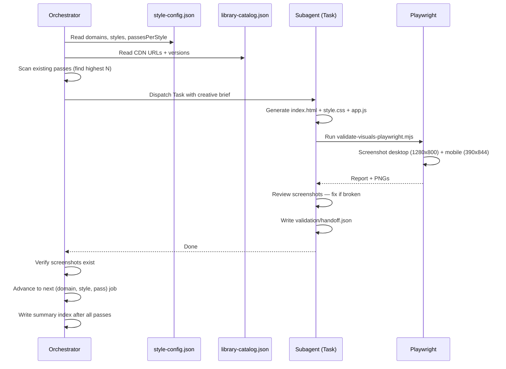

# Visual Creative — Architecture

## Component Map

```
.claude/
  agents/
    planning-visual-creative-orchestrator/AGENT.md   — Reads config, builds briefs, dispatches
    visual-creative-subagent/AGENT.md                — Generates one pass (HTML + validation)
  skills/
    planning-visual-creative-orchestrator/SKILL.md
      references/
        style-config.json                            — Domains, styles, passes, mock datasets
        agent-behavior.md                            — Orchestrator rules
    visual-creative-subagent/SKILL.md
      references/
        library-catalog.json                         — CDN URLs + versions for all libraries
        agent-behavior.md                            — Subagent rules
      scripts/
        validate-visuals-playwright.mjs              — Playwright validation script
.docs/design/concepts/
  data-vis/<chart-type>/pass-<n>/
  animation/<animation-style>/pass-<n>/
  graphic-design/<design-style>/pass-<n>/
```

## Generation Flow



## Pass Increment Logic

```
New generation run starts
  │
  ├─ Scan .docs/design/concepts/<domain>/<style>/
  ├─ Find highest existing pass-N
  ├─ New passes start at N+1
  └─ Existing passes are NEVER overwritten
```

## Three Domain Libraries

| Domain | Libraries |
|--------|-----------|
| `data-vis` | D3.js, Chart.js, ECharts, Vega-Lite |
| `animation` | GSAP, p5.js, Anime.js, Matter.js |
| `graphic-design` | Three.js, p5.js, Paper.js, PixiJS |

## Output Structure Per Pass

```
pass-N/
  index.html                   — self-contained showcase (CDN libs, inline data)
  style.css                    — additional styles if needed
  app.js                       — logic if needed
  README.md                    — pass description + design decisions
  validation/
    handoff.json               — pass metadata + library versions
    desktop/showcase.png       — Playwright desktop capture
    mobile/showcase.png        — Playwright mobile capture
    report.playwright.json     — test report
```

## Self-Correction Loop

```
Subagent runs Playwright validation
  │
  ├─ Screenshots look correct → done
  │
  └─ Screenshots broken (blank, error, layout wrong)
      ├─ Diagnose: inspect HTML + console errors
      ├─ Fix: update index.html / app.js
      ├─ Re-run Playwright
      └─ Repeat until screenshots are acceptable
```

## Error Handling

| Problem | Resolution |
|---------|-----------|
| CDN library fails to load | Check `library-catalog.json` — use fallback CDN URL |
| Blank screenshot | Add `waitForLoadState('networkidle')` in validation script |
| Pass already exists | Scan increments past existing; existing passes never touched |
| Subagent generates template-looking output | Brief must specify domain-specific data from `mockDatasets` |
