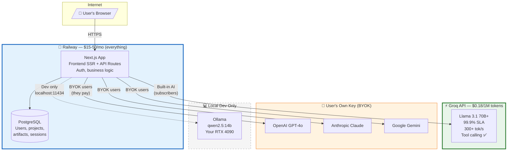
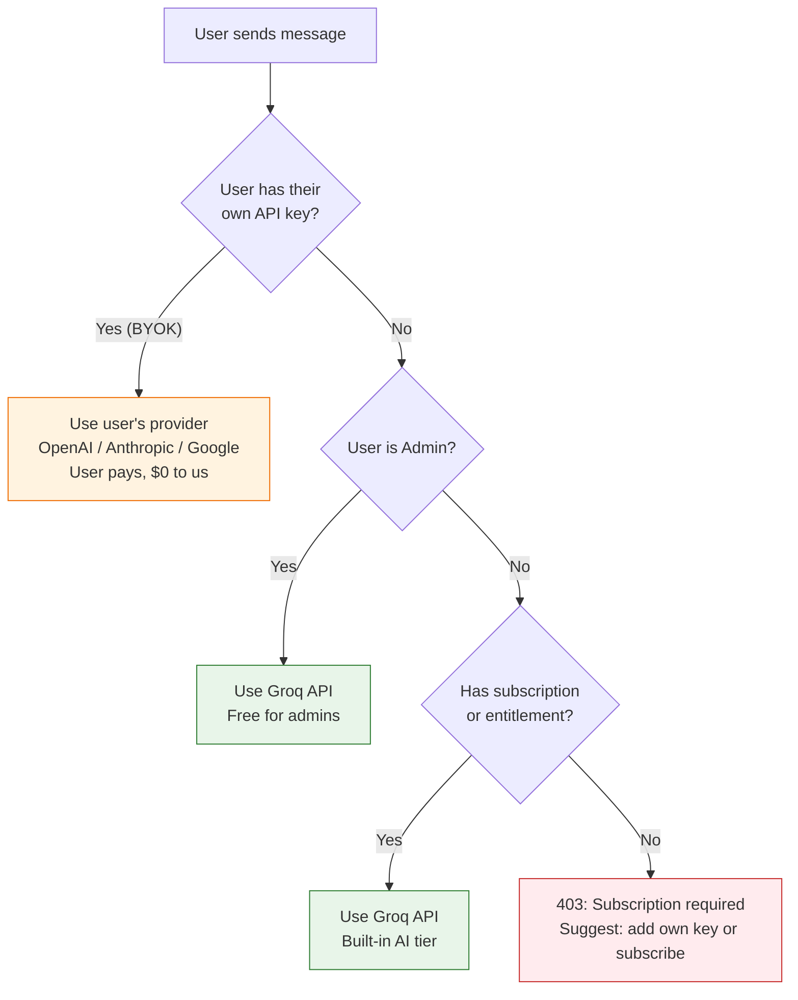
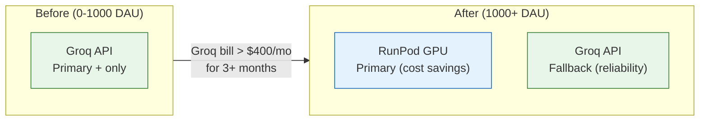
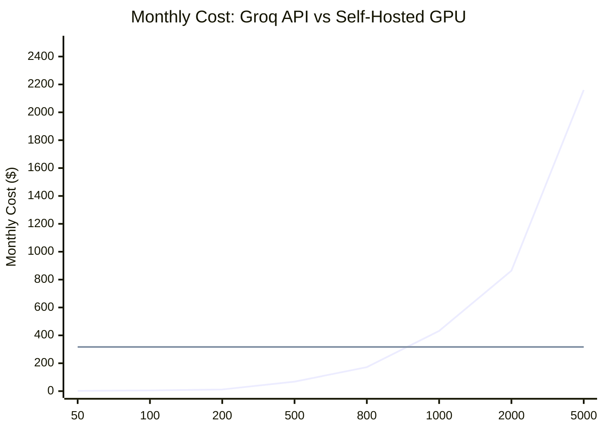
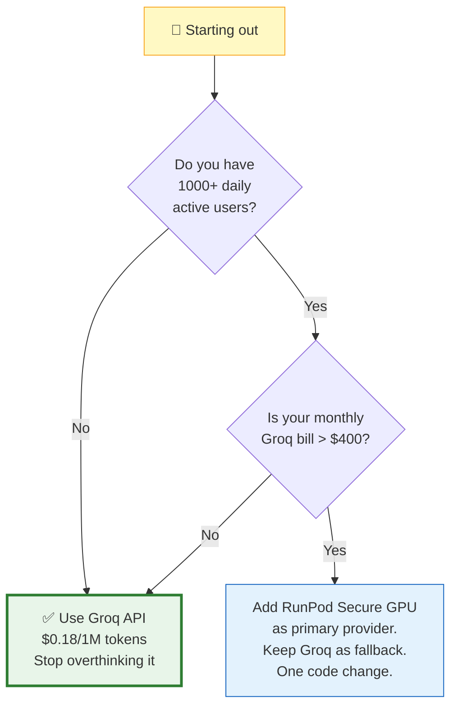

# Architecture & Recommendations

## The Reality Check

**Don't plan for 4 hosting migrations.** If your app goes viral overnight, you don't want to be scrambling to migrate from Vast.ai community to RunPod dedicated while users are complaining about downtime. Pick an architecture that works from day one to 10,000 users with minimal changes.

The phased approach (cheap → slightly less cheap → medium → expensive) sounds smart but is actually:
- **4 migration headaches** with downtime, DNS changes, data moves
- **4 different debugging environments** to understand
- **Risk of outgrowing a tier faster than you can migrate**

Instead, pick a setup that **scales in place** — you pay more per unit at low volume but never have to re-architect.

## Deployment Architectures

### Architecture 1: Groq API + Railway (RECOMMENDED)

Use a hosted AI API as primary. No GPU server. Scales from 1 to 10,000+ users with zero infrastructure changes — you just pay more.

```
                    Internet
                       │
              ┌────────┴────────┐
              ▼                 ▼
     ┌──────────────┐  ┌──────────────┐
     │   Vercel      │  │   Railway    │
     │   Frontend    │  │   Backend    │
     │   (SSR/CDN)   │  │   + Postgres │
     │   $0-20/mo    │  │   $15-50/mo  │
     └──────────────┘  └──────┬───────┘
                              │ HTTPS
                       ┌──────▼───────┐
                       │   Groq API   │
                       │   (Managed)  │
                       │              │
                       │  $0.18/1M    │
                       │  tokens      │
                       │  99.9% SLA   │
                       │  300+ tok/s  │
                       └──────────────┘

     50 users: ~$25/mo
     500 users: ~$90/mo
     5000 users: ~$2,200/mo
```

**Pros:**
- Zero infrastructure to manage — no GPU servers, no Ollama, no Docker
- 99.9% uptime SLA from Groq
- Fastest inference in the industry (300+ tok/s — instant responses)
- Large hosted models (70B+) = near-perfect tool calling, no hallucination
- Scales linearly: more users = more tokens = proportionally more cost
- No cold starts, no machine reclamation, no community host issues
- BYOK users bypass this entirely (they pay their own provider)

**Cons:**
- You depend on Groq's API availability (mitigated by BYOK fallback)
- At very high volume (5000+ users), self-hosting becomes cheaper
- You don't control the model (can't fine-tune, can't use custom models)
- Per-token cost never goes to zero

**Why this is the best starting point:** You want reliable AI that works every time, uses tools correctly, and doesn't hallucinate. Groq runs 70B+ models that are dramatically better at tool calling than any 3B-14B model you'd self-host. The cost is negligible at low volume ($1-30/mo) and scales proportionally. When you hit 2000+ users and API costs exceed $400/mo, THEN consider adding a self-hosted GPU.

### Architecture 2: All-in-One GPU Server

Everything on one rented GPU machine. Good for high-volume production.

```
                    Internet
                       │
              ┌────────▼────────────────┐
              │   GPU Server (RunPod)    │
              │                          │
              │  ┌────────┐ ┌─────────┐ │
              │  │Next.js │ │Postgres │ │
              │  │Backend │ │Database │ │
              │  └───┬────┘ └─────────┘ │
              │      │ localhost:11434   │
              │  ┌───▼────────────────┐ │
              │  │   Ollama           │ │
              │  │   qwen2.5:14b      │ │
              │  │   (GPU accelerated)│ │
              │  └────────────────────┘ │
              │                          │
              │   $200-400/mo total      │
              └──────────────────────────┘
```

**Pros:** Zero per-token cost, zero network latency, full model control
**Cons:** Single point of failure, you manage the server, smaller model = less reliable tool calling

**Honest assessment:** Only makes sense when your monthly API bill exceeds the server cost (~$300-400/mo). That's roughly 2000+ daily active users. Before that, you're paying for idle GPU time.

### Architecture 3: Split Hosting (GPU Separate)

Frontend and backend on standard hosts, GPU server separate for AI only.

```
                    Internet
                       │
              ┌────────┴────────┐
              ▼                 ▼
     ┌──────────────┐  ┌──────────────┐
     │   Vercel      │  │   Railway    │
     │   Frontend    │  │   Backend    │
     │   (SSR/CDN)   │  │   + Postgres │
     │   $0-20/mo    │  │   $15-50/mo  │
     └──────────────┘  └──────┬───────┘
                              │ HTTPS
                       ┌──────▼───────┐
                       │   RunPod     │
                       │   Secure     │
                       │   GPU Server │
                       │   Ollama     │
                       │  $400-1200/mo│
                       └──────────────┘

     Total: $435-1,270/mo (regardless of user count)
```

**Pros:** Each component scales independently, zero per-token cost
**Cons:** Network latency (50-200ms per AI call), three bills, three things to monitor, expensive at low volume

**Honest assessment:** This is the enterprise path. Reliable, but expensive. Only justified if you need compliance (HIPAA, SOC2) or full model control (fine-tuning, custom weights).

### Architecture 4: Serverless GPU

Pay only when AI is actively processing.

```
                    Internet
                       │
              ┌────────▼────────┐
              │   Railway        │
              │   Backend        │
              └────────┬────────┘
                       │
              ┌────────▼────────┐
              │   RunPod         │
              │   Serverless     │
              │                  │
              │  Active: $0.94/hr│
              │  Idle: $0/hr     │
              │  Cold: ~15 sec   │
              └──────────────────┘
```

**Pros:** Zero idle cost, scales automatically
**Cons:** 15-30 second cold starts kill the user experience. First message after idle = user stares at a loading spinner for 15+ seconds. Unacceptable for a production app.

**Honest assessment:** Cold starts make this unsuitable as a primary AI provider. Could work as a fallback, but Groq API is better in every way for this use case.

## Provider Reliability Comparison

This is the table that actually matters:

| Provider | Uptime SLA | Machine Reclamation Risk | Cold Starts | Tool Calling Quality |
|----------|-----------|------------------------|-------------|---------------------|
| **Groq API** | 99.9% | None (managed) | None | ✅ Excellent (70B models) |
| **Together AI** | 99.9% | None (managed) | None | ✅ Good |
| RunPod Secure | 99.5% | None (dedicated) | None | ⚠️ Depends on model size |
| RunPod Community | ~99% | ⚠️ Possible | None | ⚠️ Depends on model size |
| Lambda Labs | 99.9% | None (dedicated) | None | ⚠️ Depends on model size |
| Vast.ai Community | **No SLA** | ❌ **High risk** | None | ⚠️ Depends on model size |
| RunPod Serverless | 99.5% | None | ❌ **15-30 sec** | ⚠️ Depends on model size |
| GCP/AWS/Azure | 99.99% | None | None | ⚠️ Depends on model size |

**Key insight:** Managed API providers (Groq, Together) give you better tool calling quality because they run larger models (70B+) than you'd self-host (14B). The self-hosted 14B model is cheaper per-token but significantly worse at following instructions.

## Cost Comparison Matrix

| Monthly Users | Messages/Day | Tokens/Month | Groq API | Self-Hosted GPU | Difference |
|--------------|-------------|-------------|---------|----------------|-----------|
| 50 | 500 | 7.5M | **$2** | $317 | API saves $315 |
| 200 | 4,000 | 60M | **$12** | $317 | API saves $305 |
| 500 | 25,000 | 375M | **$68** | $317 | API saves $249 |
| 1,000 | 100,000 | 2.4B | $432 | **$317** | GPU saves $115 |
| 2,000 | 200,000 | 4.8B | $864 | **$317** | GPU saves $547 |
| 5,000 | 500,000 | 12B | $2,160 | **$317** | GPU saves $1,843 |

**Crossover point: ~800-1000 daily active users.** Below that, Groq API is cheaper. Above that, self-hosting wins on cost — but you sacrifice tool calling quality unless you run a 70B+ model (which needs an A100 at $1,181/mo).

## Frontend Hosting Options

Since our app is a single Next.js codebase (frontend SSR + API routes), we can either split hosting or keep everything together.

| Frontend Host | Cost | Next.js SSR | Separate from Backend? | Tradeoffs |
|---|---|---|---|---|
| **Railway (same as backend)** | **$0 extra** | ✅ Full | **No — one deploy** | Simplest. One platform, one bill, one deploy. No CORS. |
| Vercel | $0-20/mo | ✅ Best | Yes — two deploys | Best DX + edge CDN, but CORS config needed, two bills |
| Render | $7-25/mo | ✅ Full | Yes | Slower deploys, decent |
| Fly.io | $5-30/mo | ✅ Full | Yes | Good edge, more ops work |
| Cloudflare Pages | $0-20/mo | ⚠️ Partial | Yes | Fast CDN but Next.js SSR compat issues |
| Coolify (self-hosted) | $0 + VPS | ✅ Full | Depends | Total control, you manage it |

**Why splitting frontend is unnecessary for us:** Our Next.js app is one codebase — `apps/web` contains both the frontend pages AND the API routes. Splitting to Vercel + Railway means two deploys, CORS configuration, env var sync between platforms, and more debugging complexity. Railway hosts the entire Next.js app as one service.

## Actual Recommendation

**Railway for everything. Groq API for AI. That's it.**

### Recommended System Architecture



### Why This is the Simplest Setup

| Concern | Split Hosting (Vercel + Railway) | All-in-One (Railway only) |
|---------|--------------------------------|--------------------------|
| Deploys | 2 separate deploys | **1 deploy** |
| Bills | 2 bills | **1 bill** |
| Env vars | Sync between 2 platforms | **1 set** |
| CORS | Must configure | **Not needed** |
| CI/CD | 2 pipelines | **1 pipeline** |
| Debugging | Check 2 platforms | **1 platform** |
| Total cost | $15-70/mo | **$15-50/mo** |

### Cost at Each Stage

| Component | Provider | Cost | Why |
|-----------|----------|------|-----|
| App + DB | **Railway** | $15-50/mo | Next.js SSR + API + Postgres, one deploy |
| AI (built-in) | **Groq API** | $0.18/1M tokens | Fastest, most reliable, best tool calling |
| AI (BYOK) | User's own key | $0 to us | OpenAI/Anthropic/Google — user pays |
| AI (local dev) | Ollama on your PC | $0 | For development/testing only |
| **Total at launch** | | **$15-50/mo** | |
| **Total at 500 users** | | **$65-120/mo** | |
| **Total at 2000 users** | | **$350-500/mo** | Consider self-hosting GPU at this point |

### How the AI Provider Resolution Works



### When to Add Self-Hosted GPU (The One Migration)

When your monthly Groq bill consistently exceeds $400/mo for 3+ months, add a RunPod Secure GPU **alongside** Groq — don't replace it.



**One migration, not four.** Your code already supports multiple providers — adding a GPU is a config change, not a re-architecture. Groq stays as fallback, self-hosted becomes primary for cost savings.

### Monthly Cost Trajectory



The crossover is at ~800-1000 DAU. Below that, API wins. Above that, GPU wins on cost (but API still wins on tool calling quality with 70B models vs self-hosted 14B).

## Decision Framework


