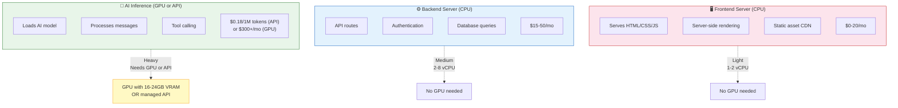

# Server Types Explained

## What's the Difference?

When hosting a web application with AI features, you're dealing with three fundamentally different workloads that need different types of servers.



### 1. Frontend Server (CPU-only)

Serves your Next.js/React pages to users' browsers. This is lightweight — just HTML, CSS, JS, and API routing.

**What it does:** Renders pages, serves static assets, handles SSR
**Hardware needed:** 1-2 vCPU, 512MB-2GB RAM, no GPU
**Cost:** $0-20/month
**Providers:** Vercel, Netlify, Cloudflare Pages, Railway

### 2. Backend + Database Server (CPU-only)

Runs your API routes, handles authentication, queries the database, manages business logic.

**What it does:** API endpoints, Prisma queries, auth, file uploads
**Hardware needed:** 2-8 vCPU, 4-16GB RAM, SSD storage, no GPU
**Cost:** $5-50/month
**Providers:** Railway, Render, Fly.io, DigitalOcean, Hetzner

### 3. GPU Server (AI Inference)

Runs the AI model (Ollama + qwen2.5:14b). This is the only component that needs a GPU. GPUs are specialized processors designed for the massive parallel math that neural networks require.

**What it does:** Loads the AI model into GPU memory, processes user messages, generates responses, executes tool calls
**Hardware needed:** 1 GPU with 16-24GB VRAM, 16-32GB system RAM
**Cost:** $100-500/month (dedicated) or $0.10-0.30/1M tokens (API)
**Providers:** RunPod, Vast.ai, Lambda, GCP, AWS

## Why Can't Regular Servers Run AI Models?

A 14B parameter model requires:
- **GPU (fast):** ~8-10GB VRAM, generates 25-35 tokens/second
- **CPU (slow):** ~16GB RAM, generates 1-3 tokens/second

That's a 10-15x speed difference. A response that takes 2 seconds on GPU takes 20-30 seconds on CPU. For a production app, CPU inference is not viable.

```
┌─────────────────────────────────────────────────────────┐
│                    GPU vs CPU Inference                   │
├─────────────────────────────────────────────────────────┤
│                                                           │
│  GPU (RTX 4090):  ████████████████████████████ 35 tok/s  │
│  GPU (A10):       ██████████████████████ 25 tok/s        │
│  CPU (i9-14900K): ███ 3 tok/s                            │
│  CPU (4 vCPU):    █ 1 tok/s                              │
│                                                           │
│  For a 200-token response:                                │
│  GPU: ~6 seconds                                          │
│  CPU: ~60-200 seconds                                     │
└─────────────────────────────────────────────────────────┘
```

## What is a GPU Server?

A GPU server is a computer with one or more dedicated graphics cards (GPUs) optimized for AI workloads. These are typically:

| GPU | VRAM | Use Case | Relative Speed |
|-----|------|----------|---------------|
| RTX 3090 | 24 GB | Budget inference | Fast |
| RTX 4090 | 24 GB | Best consumer GPU | Very fast |
| A10 / A10G | 24 GB | Cloud inference standard | Fast |
| L4 | 24 GB | Google's inference GPU | Fast |
| A40 | 48 GB | Larger models | Fast |
| A6000 | 48 GB | Professional workstation | Very fast |
| A100 | 40/80 GB | Enterprise standard | Fastest |
| H100 | 80 GB | Cutting edge | Ultra fast |

For our 14B model (qwen2.5:14b at Q4 = ~8.5GB), any GPU with 16GB+ VRAM works. The sweet spot is **RTX 4090 or A10** (24GB, affordable, fast enough).

## How the Pieces Connect

```
User's Browser
      │
      ▼
┌──────────────┐         ┌──────────────┐
│   Frontend   │────────▶│   Backend    │
│   (Vercel)   │◀────────│  (Railway)   │
│              │         │  + Postgres  │
└──────────────┘         └──────┬───────┘
                                │
                     localhost or network
                                │
                         ┌──────▼───────┐
                         │  GPU Server  │
                         │   (RunPod)   │
                         │   Ollama +   │
                         │  qwen2.5:14b │
                         └──────────────┘
```

**Option A: Split hosting** — Frontend on Vercel, backend on Railway, AI on a GPU provider. Three bills, but each component is optimized.

**Option B: All-in-one GPU server** — Everything runs on one rented GPU machine. Simpler, and the backend calls Ollama at `localhost:11434` with zero network latency.

```
User's Browser
      │
      ▼
┌──────────────────────────────┐
│     Single GPU Server        │
│  ┌──────────┐ ┌───────────┐ │
│  │ Next.js  │ │ PostgreSQL│ │
│  │ Backend  │ │  Database │ │
│  └────┬─────┘ └───────────┘ │
│       │ localhost:11434      │
│  ┌────▼─────────────────┐   │
│  │   Ollama + Model     │   │
│  │   (GPU accelerated)  │   │
│  └──────────────────────┘   │
└──────────────────────────────┘
```
