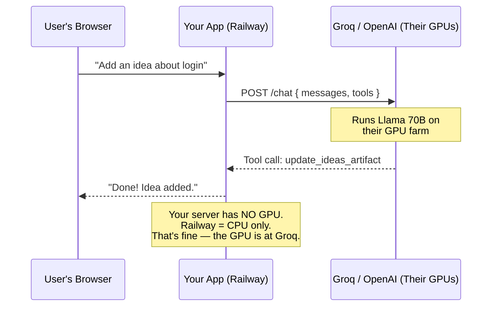
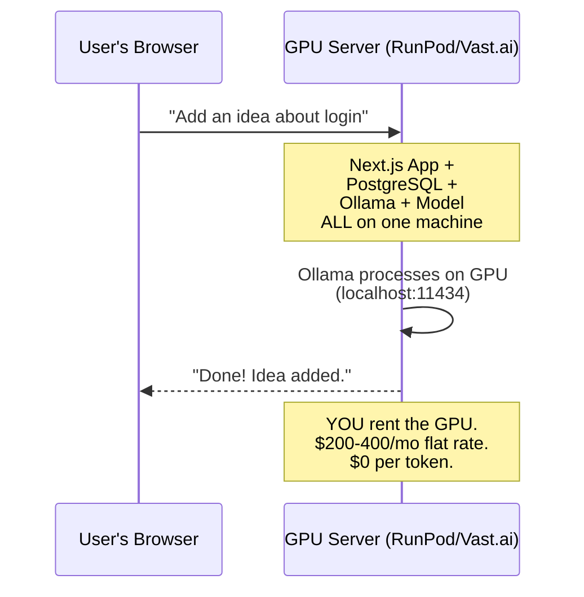
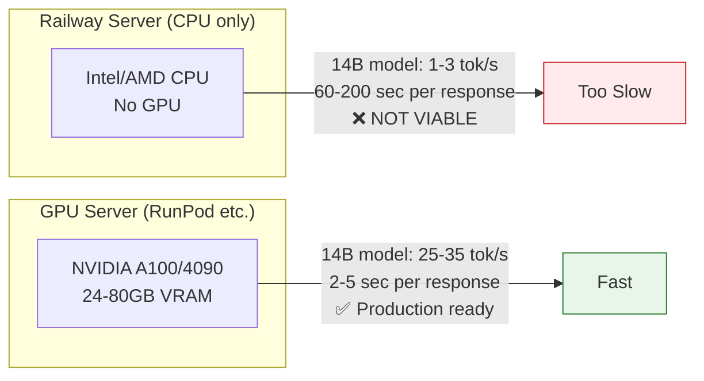
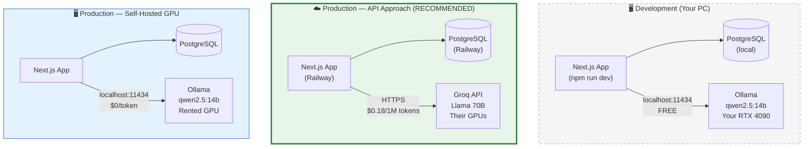

# Server Types Explained

## The Two Ways to Run AI

There are exactly two ways to make AI work in your app. You pick one.

### Option 1: Call Someone Else's AI (API Provider)

You send text to a company that owns GPUs (like Groq, OpenAI, Anthropic). They run the AI model on their hardware and send back the response. You pay per use.



**You don't need a GPU.** Railway ($20/mo) hosts your app. Groq ($0.18/1M tokens) runs the AI. Two separate bills but total cost is low.

**This is like:** Using Stripe for payments. You don't run a payment processor — you call their API. Same concept for AI.

### Option 2: Run Your Own AI (Self-Hosted GPU)

You rent a server that has a GPU, install Ollama + the AI model on it, and your app calls it directly. No external API.



**You DO need a GPU.** You can't use Railway for this — Railway has no GPUs. You rent a GPU server from RunPod ($317/mo) or Vast.ai ($150-288/mo) and run everything on it.

**This is like:** Buying your own payment processing hardware instead of using Stripe. More control, but you manage it.

## Why Can't Railway Run the AI Model?



AI models need GPUs for the parallel math that neural networks require. Railway/Render/Vercel are CPU-only hosting platforms. Running a 14B model on CPU takes minutes per response — unusable for a real app.

## The Three Environments



**Development:** Ollama runs on your RTX 4090. Free. Fast. Works great for testing.

**Production (recommended):** App on Railway, AI via Groq API. No GPU server needed. Pay per token.

**Production (alternative):** Everything on one GPU server. Pay flat monthly rate. Only makes sense when token costs exceed server rent (~1000+ daily active users).

## What is a GPU Server?

A GPU server is a computer with specialized graphics cards (GPUs) designed for AI computation. You rent one from a cloud provider:

| GPU | VRAM | Best For | Speed (14B model) | Rental Cost |
|-----|------|----------|-------------------|-------------|
| RTX 3090 | 24 GB | Budget AI | ~25 tok/s | $108-216/mo |
| RTX 4090 | 24 GB | Best consumer | ~35 tok/s | $144-317/mo |
| A10 / A10G | 24 GB | Cloud standard | ~25 tok/s | $432-724/mo |
| A100 | 40-80 GB | Enterprise | ~50 tok/s | $792-2,642/mo |

**For our 14B model**, any GPU with 24GB+ VRAM works. The cheapest option is an RTX 3090 on Vast.ai (~$150/mo).

## What is an API Provider?

An API provider runs AI models on their own GPU farms and lets you call them via HTTP. You never touch a GPU.

| Provider | How It Works | Cost | Model Quality |
|----------|-------------|------|---------------|
| **Groq** | Send HTTP request → get AI response | $0.18/1M tokens | Excellent (70B+) |
| Together AI | Same | $0.20/1M tokens | Good |
| OpenAI | Same | $2.50/1M tokens | Excellent |
| Anthropic | Same | $3.00/1M tokens | Excellent |

**Groq is recommended** because it's the cheapest API provider with 99.9% uptime and the fastest inference (300+ tokens/second).

## Summary: What We're Using

```
DEVELOPMENT                          PRODUCTION
┌─────────────────────┐              ┌─────────────────────┐
│ Your PC              │              │ Railway              │
│ ├─ Next.js (dev)     │              │ ├─ Next.js App       │
│ ├─ PostgreSQL        │              │ ├─ PostgreSQL        │
│ └─ Ollama (RTX 4090) │              │ └─ Calls Groq API ──┼──▶ Groq (their GPUs)
│    FREE               │              │    $15-50/mo         │     $0.18/1M tokens
└─────────────────────┘              └─────────────────────┘
```
