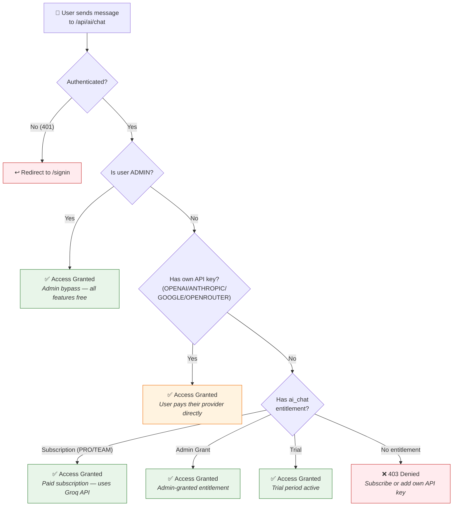
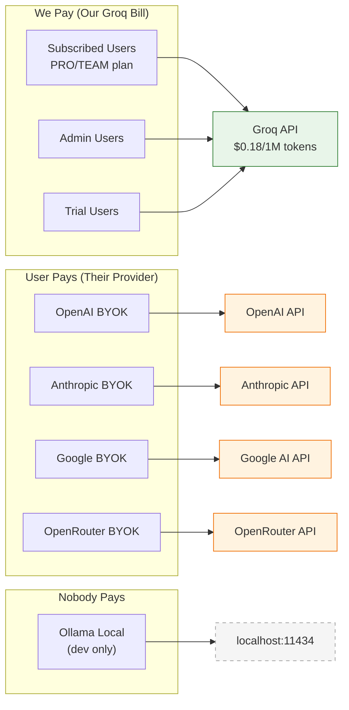
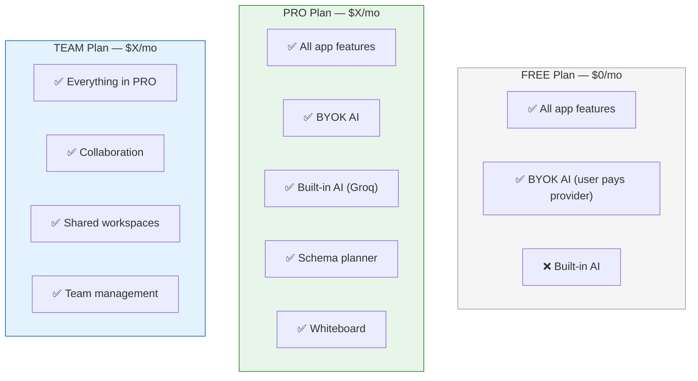
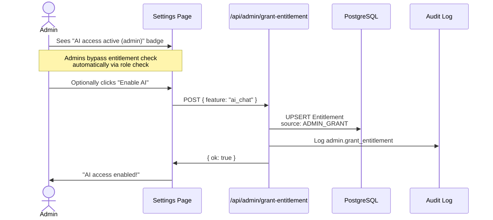
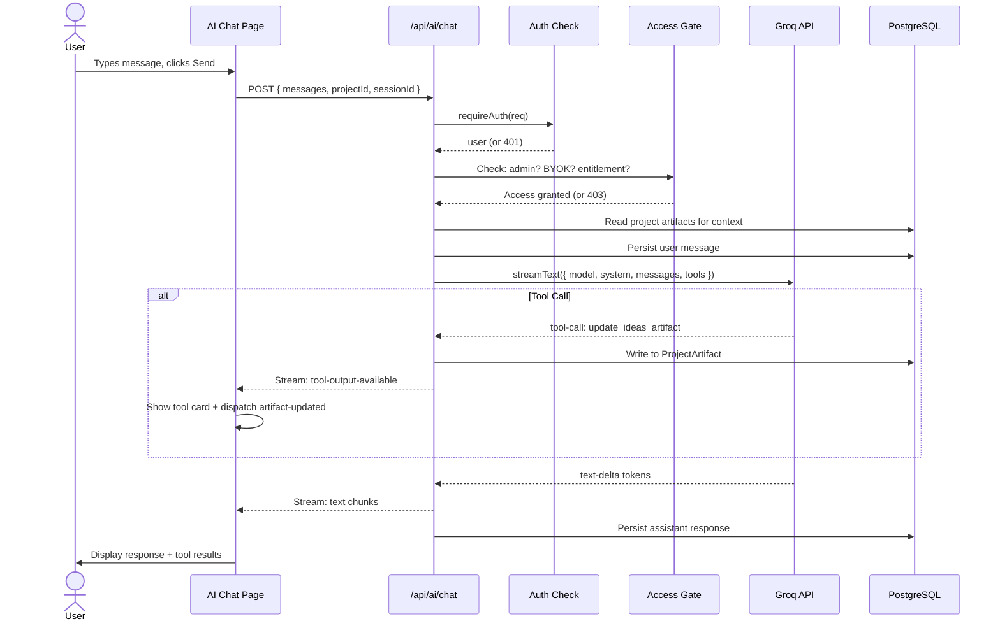

# AI Chat Access Flow

## Overview

The AI chat feature has a tiered access model that balances free access for BYOK users, paid access for built-in AI, and full bypass for admins.

## Access Decision Tree

## Who Pays for What

## Provider Types and Billing

| Provider | Who Pays | Access Gate | Used In |
|----------|----------|-------------|---------|
| GROQ (built-in) | Us (our API bill) | Requires subscription or admin grant | Production |
| OPENROUTER_BYOK | User pays OpenRouter | No subscription needed | Production |
| OPENAI_BYOK | User pays OpenAI | No subscription needed | Production |
| ANTHROPIC_BYOK | User pays Anthropic | No subscription needed | Production |
| GOOGLE_BYOK | User pays Google | No subscription needed | Production |
| OLLAMA_LOCAL | Nobody (free, local) | Requires subscription or admin grant | Development |

### Why BYOK Users Bypass Billing
Users who bring their own API key are paying their AI provider directly. We don't incur any AI costs for these users, so there's no reason to charge them for AI access. The subscription only gates access to our built-in AI (Groq), where we pay the per-token cost.

### Why Built-In AI Requires Billing
When users use the built-in AI, every token costs us $0.18 per 1M tokens via Groq. The subscription covers this cost plus margin. Without billing, heavy users could generate significant API bills that we absorb.

## Subscription Plans and AI Access

| Plan | AI Chat Access | AI Features |
|------|---------------|-------------|
| FREE | BYOK only | Chat + tools (user's own provider) |
| PRO | Built-in + BYOK | Chat + tools + Groq-powered AI |
| TEAM | Built-in + BYOK | Chat + tools + Groq-powered AI + collaboration |

## Admin Self-Grant Flow

### API: POST /api/admin/grant-entitlement
- Requires admin role
- Body: `{ feature: "ai_chat", targetUserId?: "user_id" }`
- Defaults to granting to the requesting admin's own account
- Creates/upserts Entitlement record with source=ADMIN_GRANT
- Logged in audit trail

## Entitlement Sources

| Source | Description | Created By |
|--------|-------------|------------|
| SUBSCRIPTION | From active Stripe subscription | Stripe webhook handler |
| ADMIN_GRANT | From admin self-grant or admin granting to user | POST /api/admin/grant-entitlement |
| TRIAL | From trial period | Future: trial signup flow |

## Error Messages

| Status | Error | User Sees | Action |
|--------|-------|-----------|--------|
| 401 | unauthorized | Redirect to /signin | Session expired |
| 403 | ai_subscription_required | "Subscribe or add your own API key" | No entitlement |
| 503 | ai_not_configured | "Install Ollama or add API key" | No provider configured |

## Request Flow (Full Sequence)

## Files

| File | Purpose |
|------|---------|
| `apps/web/src/app/api/ai/chat/route.ts` | Chat endpoint with access check |
| `apps/web/src/server/billing/entitlements.ts` | Entitlement check logic |
| `apps/web/src/server/ai/get-user-model.ts` | Provider resolution (Groq, BYOK, Ollama) |
| `apps/web/src/app/api/admin/grant-entitlement/route.ts` | Admin self-grant endpoint |
| `apps/web/src/app/(authenticated)/settings/page.tsx` | AI config UI + admin badge |
| `apps/web/src/server/ai/tools/artifact-tools.ts` | 8 tools the AI can call |
