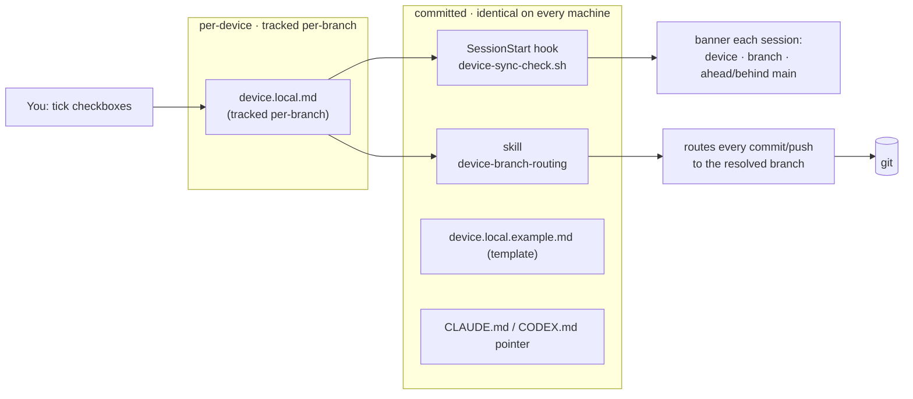

# Runbook — Device-Aware Branch Convention

> **What this is:** how DualLeads routes git commits/pushes to the right branch depending on
> which physical machine you're on, controlled by **one file you edit: `device.local.md`**.
> **Audience:** you (the repo owner) + any AI agent (Claude Code / Codex) working in this repo.
> **Status:** ✅ Active. Design rationale: `.docs/planning/plans/2-device-aware-branch-convention.md`.

---

## TL;DR

```
Edit ONE file → device.local.md  (repo root, tracked per-branch)
   ▸ check which device this is        → home-desktop | asus-laptop
   ▸ check the default target          → device-default | main
   ▸ check the release method          → direct-push | pr-release
The agent reads it and commits/pushes to the right branch automatically.
On the laptop, "push" never means main unless you say "push to main".
```

| Device | Default branch | `main` (handoff + savepoint + stable/prod) |
|--------|----------------|--------------------------------------------|
| 🖥 `home-desktop` (Home PC) | `Home-Work` | synced from your lane at wind-down (`/winddown`) |
| 💻 `asus-laptop` (this machine) | `Asus-Work` | synced from your lane at wind-down (`/winddown`) |

> `main` is **not** a daily lane — both devices work on their own `*-Work` lane and fast-forward
> `main` to the latest handoff at wind-down. Companion protocol:
> `.docs/runbooks/development/device-sync-and-handoff-protocol.md`.

---

## 1. Prerequisites

- [ ] Git repo cloned, `origin` = `https://github.com/pelchers/DualLeads.git`.
- [ ] `main` branch exists on `origin` (the handoff + savepoint + stable/prod branch — synced from your working lane at wind-down).
- [ ] Git Bash available (the sync hook is a bash script; Claude Code runs it on `SessionStart`).
- [ ] You can edit a markdown file. That's the whole skill.

---

## 2. How it works (architecture)



**Split of concerns:** the *rules* (skill, hook, CLAUDE.md pointer, template) are committed and
identical everywhere. The *toggle* (`device.local.md`) is **tracked and committed on each device's
branch** (no-ignore policy) — so the laptop's `device.local.md` lives on `Asus-Work`, the desktop's
on its own branch, and each device's lane self-describes and is understood on the other device.

---

## 3. ⭐ USER GUIDE — set this up on a NEW PC / device

Do this **once** per machine, right after cloning.

### Step 1 — create your toggle file
```bash
cp device.local.example.md device.local.md
```
(Or just start a session — the `SessionStart` hook auto-creates it from the template and tells
you to pick a device. Or run `/device`.)

### Step 2 — pick this device
Open `device.local.md` and check **exactly one** box in section 1:
```markdown
## 1. Which device is this?            (check exactly ONE)
- [ ] home-desktop      # 🖥 Home PC
- [x] asus-laptop       # 💻 Asus laptop      ← checked on this machine
```

### Step 3 — leave sections 2–3 on defaults (recommended)
```markdown
## 2. Default commit/push target
- [x] device-default    # home → Home-Work,  asus → Asus-Work
## 3. Release method to main
- [x] direct-push       # /winddown fast-forwards main to your handoff
```

### Step 4 — save. Done.
Next session the banner confirms it:
```
[device-sync] device=asus-laptop | branch=Asus-Work | default-target=Asus-Work | release=direct-push
[device-sync] SYNCED with main
```

### Adding a brand-new device later (e.g. a second laptop)
1. Pick a name: `<name>-device` with branch `<Name>-Work` (e.g. `surface-laptop` → `Surface-Work`).
2. Add the two lines to `device.local.example.md` section 1 (committed) and to the skill's
   resolution table (`device-branch-routing/SKILL.md`).
3. On that machine, `cp` the template and check the new device.
4. Tell the AI agent in chat — it'll follow the same routing shape automatically.

---

## 4. Daily use — what to say

| You type / say | On `home-desktop` | On `asus-laptop` |
|---|---|---|
| "commit this" | commits on `Home-Work` | commits on `Asus-Work` |
| "push" | pushes `Home-Work` | pushes `Asus-Work` (NOT main) |
| "push to main" / "merge to main" | pushes `main` (explicit override) | pushes/merges `Asus-Work` → `main` |
| `/winddown` | syncs `Home-Work` → `main` (handoff) | syncs `Asus-Work` → `main` (handoff) |
| `/device` | shows + lets you change the toggle | same |

> The laptop's **push-gate**: a bare "push" or "commit" never touches `main`. You must say
> "**push to main**" (or "merge to main") to release. This is enforced by the
> `device-branch-routing` skill.
>
> Both devices sync `main` to their working lane at **wind-down** (`/winddown`, skill
> `device-sync-protocol`) — `main` holds the latest handoff + savepoints + stable/prod, not daily work.

---

## 5. Changing a toggle (any machine)

```bash
/device              # show current state
/device home         # switch this machine to the home desktop (→ Home-Work)
/device asus         # switch this machine to the Asus laptop (→ Asus-Work)
/device pr           # switch release method to PR-into-main
```
…or just hand-edit `device.local.md` and re-tick a box. It's the only file you ever touch.

---

## 6. Environment / file reference

| File | Committed? | Role |
|---|---|---|
| `device.local.md` | ✅ tracked per-branch | **The toggle you edit.** Committed on this device's branch (no-ignore policy). |
| `device.local.example.md` | ✅ | Template a new machine copies. |
| `.claude/hooks/scripts/device-sync-check.sh` | ✅ | SessionStart banner (branch + ahead/behind main). |
| `.codex/hooks/scripts/device-sync-check.sh` | ✅ | Codex mirror of the hook. |
| `.claude/skills/device-branch-routing/SKILL.md` | ✅ | Resolution + push-gate logic. |
| `.codex/skills/device-branch-routing/SKILL.md` | ✅ | Codex mirror. |
| `.claude/commands/device.md` (`/device`) | ✅ | View/flip the toggle. |
| `.codex/commands/device.md` | ✅ | Codex mirror. |
| `.claude/settings.json` → `SessionStart` | ✅ | Wires the hook. |
| `.claude/CLAUDE.md` / `.codex/CODEX.md` / `.codex/AGENTS.md` | ✅ | The committed convention pointer. |

---

## 7. Sync-status banner — reading it

| Banner | Meaning | Do |
|---|---|---|
| `SYNCED with main` | HEAD == origin/main | proceed |
| `AHEAD of main by N` | you have N unpushed commits | normal on a work branch; release when ready |
| `BEHIND main by N` | origin/main moved ahead | `git pull --rebase origin main` before working |
| `DIVERGED (ahead A / behind B)` | both moved | reconcile (rebase) before pushing |
| `... (local ref, may be stale)` | fetch was offline/slow | counts use last-known origin/main |
| `no device checked ...` | section 1 has no `[x]` | edit `device.local.md`, tick a device |

---

## 8. Troubleshooting

| Symptom | Cause | Fix |
|---|---|---|
| Banner: `no device.local.md` | first run on this machine | `cp device.local.example.md device.local.md`, tick a device |
| Banner: `no device checked` | both boxes empty in section 1 | tick exactly one device box |
| `hostname pin != this host` warning | copied `device.local.md` from another machine | run `/device` to re-pin, or blank the `HOSTNAME=` line |
| Agent pushed to wrong branch | toggle wrong / not read | check `device.local.md`; re-run `/device`; remind agent to use `device-branch-routing` |
| Banner always `(stale)` | offline or `origin` unreachable | check network/remote; counts fall back to local `origin/main` |
| Laptop tried to push `main` on a bare "push" | should be blocked | confirm device=`asus-laptop` + target=`device-default`; the skill gate prevents it |
| `device.local.md` NOT tracked / missing from a fresh clone | it should be committed per-branch (no-ignore policy) | `git add device.local.md` and commit on this device's branch; ensure it is NOT in any `.gitignore` |

---

## 9. Validation checklist (after any change to this component)

- [ ] `bash .claude/hooks/scripts/device-sync-check.sh` prints a correct banner for this device.
- [ ] Flipping section 1 to the other device changes `default-target` accordingly.
- [ ] Removing `device.local.md` → hook reseeds from template (or prints the missing banner).
- [ ] `git ls-files device.local.md` → prints the path (it's tracked per-branch); it is NOT in any `.gitignore`.
- [ ] `.claude` and `.codex` mirrors of the hook/skill/command are byte-aligned (paths aside).
- [ ] Ahead/behind counts match `git rev-list --left-right --count origin/main...HEAD`.

---

## 10. Related

- Plan / decisions: `.docs/planning/plans/2-device-aware-branch-convention.md`
- Companion protocol (pickup / wind-down handoffs): `.docs/runbooks/development/device-sync-and-handoff-protocol.md`
- Skill: `.claude/skills/device-branch-routing/SKILL.md`
- System docs: `.codex/system_docs/device_branch_routing/README.md`
- **Portable package** (for syncing to template repos / other machines):
  `.other-devices/components/device-branch-routing/` — `FILE-TREE.md` + `MANIFEST.md` + `NOTES.md`
  + `artifacts/` + `plans/` + `snippets/`. Staging reusable work there is a repo-wide convention;
  see `.other-devices/README.md`.
