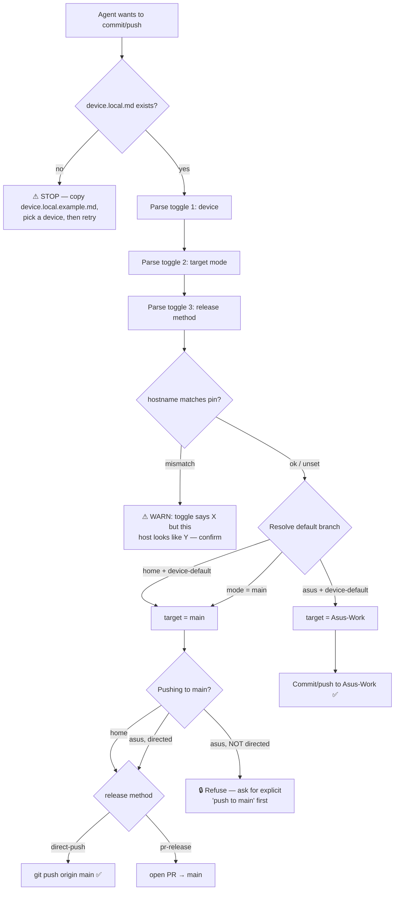
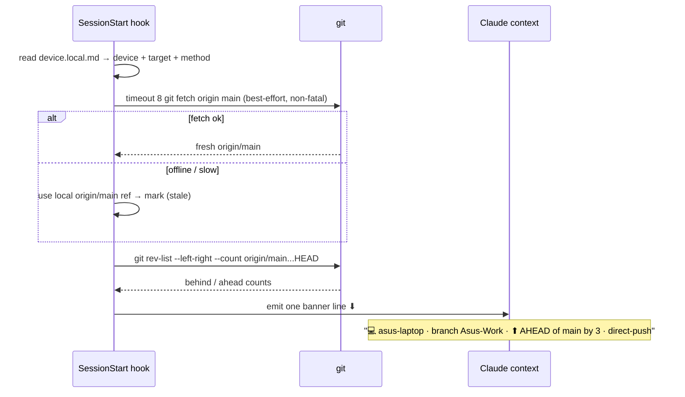

# Plan 2 — Device-Aware Branch Convention (multi-machine git routing)

> 🔁 **SUPERSEDED 2026-07-06: repositioned** — both devices default to their own working lanes
> (home → `Home-Work`, asus → `Asus-Work`); `main` = handoff/savepoint/stable/prod, synced to a
> working lane only at wind-down. See `.docs/runbooks/development/device-sync-and-handoff-protocol.md`.
> The routing mechanics below still apply; any "home-desktop defaults to `main`" statement in this
> historical body is superseded.

> ⚠️ **POLICY UPDATE (2026-06-22, supersedes the gitignore design below):** `device.local.md` is
> now **TRACKED and committed per-branch** (no-ignore policy), **not** gitignored. Each device's
> lane lives on its own branch (laptop → `Asus-Work`) so the other device can read/understand it.
> Tenets **T1/T2** below (and every "gitignored / one-per-machine / never committed" reference in
> this doc) describe the *original* design and are **historical** — see the `multi-agent-collaboration`
> component and `sync-repos-asus-laptop.md` for the current policy. The routing/skill/hook behavior
> is otherwise unchanged.

> **Status:** ✅ Built + validated (2026-06-22). Staged as a portable package under
> `.other-devices/components/device-branch-routing/` (see §12).
> **Goal:** One repo, multiple machines, *zero-thought* correct git behavior. A few checkboxes
> in **one file** tell the AI agent which device it's on; the agent then commits/pushes to the
> right branch by default and verifies sync against `main` at the start of every conversation.
> **Supersedes:** the hardcoded `Work`-branch block in `CLAUDE.md` / `.claude/CLAUDE.md` /
> `.codex/CODEX.md` / `.codex/AGENTS.md` (replaced — see §9).

---

## 0. Decisions (locked)

| # | Question | Decision |
|---|----------|----------|
| D1 | Home default target | 🖥 **home-desktop → push `main` directly.** Optional `Home` mirror branch supported but not required. |
| D2 | Rename `Work` → `Asus-Work`? | **Yes.** Future-proofs adding more devices (each gets `<Device>-Work`). |
| D3 | Toggle format & location | **Markdown checkboxes** in **one root file** `device.local.md`. It is the **ONLY** file the user ever edits, and the single file both `.claude` and `.codex` instruction files reference. |
| D4 | Sync-check networking | **Bounded best-effort fetch** (`timeout 8 git fetch`, non-fatal) → fall back to local `origin/main` ref and label it `(stale)`. Never blocks/hangs a session; accurate when online. |
| D5 | Codex parity | **Yes** — mirror skill, hook, command, system_docs into `.codex/` (syncing-claude-codex). |
| D6 | Release method | **Direct push by default** (user owns the repos; no PRs required). Added as a **3rd toggle** (`direct-push` / `pr-release`) that applies over either device; default `direct-push`. |

---

## 1. The problem in one picture

```
                    ┌─────────────────────────────────────────┐
                    │              origin/main                  │
                    │        (release / integration)            │
                    └───────────────▲───────────▲──────────────┘
            push by default          │           │   push ONLY when
            (home's normal flow)     │           │   directed in chat
                                     │           │
            ┌────────────────────────┴──┐   ┌────┴───────────────────────┐
            │   🖥  home-desktop          │   │   💻 asus-laptop            │
            │   "Home PC"                 │   │   "Asus / Work Laptop"      │
            │   default target → main     │   │   default target → Asus-Work│
            │   (optional `Home` mirror)  │   │   sync→main only on command │
            └─────────────────────────────┘   └─────────────────────────────┘

   SAME repo, SAME rules — only ONE gitignored toggle file (device.local.md) differs per machine.
```

The agent must answer **"which device am I, what's my default target, and how do I release?"**
before any commit/push — and **"am I synced with `main`?"** at the start of every session.

---

## 2. Design tenets

| # | Tenet | Why |
|---|-------|-----|
| T1 | **Rules are committed; the toggle is not.** | The *convention* is identical on every machine (commit once). The *active device* differs per machine → **gitignored**, exactly like `.env` vs `.env.example`. |
| T2 | **A committed toggle would flip-flop forever.** | If `device = asus` were committed, the desktop re-commits `device = home` next session → endless churn + wrong defaults after every pull. Gitignore kills this. |
| T3 | **"Check every conversation" ⇒ a hook, not a memory.** | The harness executes hooks; Claude can't self-trigger "every session." The sync-check must be a `SessionStart` hook. |
| T4 | **Human edits checkboxes; machine greps them.** | The requested UX is literally "I checkmark a box." Keep it; the hook/skill parse the boxes. |
| T5 | **Fail safe, never guess.** | Missing/ambiguous toggle ⇒ the agent STOPS and asks; it never guesses a push target. |
| T6 | **One file the user touches.** | `device.local.md` is the sole editable surface. Everything else (rules, skill, hook) is fixed infrastructure. |
| T7 | **Build on what exists.** | Reuse the `SessionStart` slot + `git-context-report.sh` / `auto-sync-check.sh` patterns; mirror to `.codex` per convention. |

---

## 3. Naming conventions (single source of truth)

### Devices (canonical id → aliases the user might type)
| Canonical id | Display | Device branch | Aliases |
|---|---|---|---|
| `home-desktop` | 🖥 Home PC | `Home` (optional mirror) | home, desktop, office, home pc |
| `asus-laptop` | 💻 Asus Work Laptop | `Asus-Work` | asus, laptop, work laptop |
| *future* `<name>-device` | — | `<Name>-Work` | — |

### Branches
| Branch | Role | Owner |
|---|---|---|
| `main` | Release / integration — shared truth | both (write-gated) |
| `Asus-Work` | Day-to-day work branch for the laptop (← renamed from `Work`) | `asus-laptop` |
| `Home` | *Optional* mirror branch for the desktop | `home-desktop` |

### Files & components
| Thing | Path | Committed? |
|---|---|---|
| **Toggle (source of truth, sole editable file)** | **`device.local.md`** (repo root) | ❌ gitignored |
| Toggle template (for fresh clones) | `device.local.example.md` (repo root) | ✅ committed |
| Convention rules (stable) | `.claude/CLAUDE.md` + `.codex/CODEX.md` / `AGENTS.md` → "Device Branch Convention" | ✅ committed |
| Sync-check hook | `.claude/hooks/scripts/device-sync-check.sh` (+ `.codex/` mirror) | ✅ committed |
| Routing skill | `.claude/skills/device-branch-routing/SKILL.md` (+ `.codex/` mirror) | ✅ committed |
| `/device` command | `.claude/commands/device.md` (+ `.codex/` mirror) | ✅ committed |
| System docs | `.codex/system_docs/device_branch_routing/README.md` | ✅ committed |
| Runbook + user guide | `.docs/runbooks/development/device-branch-convention.md` | ✅ committed |

> **Why root, not `.claude/`:** `device.local.md` is provider-neutral machine state referenced by
> *both* `.claude` and `.codex`. One root file = one thing to edit, no "which copy wins," and it's
> never mirror-synced (it's gitignored per-device). The committed `.example` lives beside it.

---

## 4. The toggle file (the one file you ever touch)

`device.local.md` — **one per machine, gitignored, edited by hand:**

```markdown
# THIS MACHINE  (gitignored — never committed; each device keeps its own copy)

## 1. Which device is this?            (check exactly ONE)
- [x] home-desktop      # 🖥 Home PC
- [ ] asus-laptop       # 💻 Asus Work Laptop

## 2. Default commit/push target       (check exactly ONE)
- [x] device-default    # home → main,  asus → Asus-Work     ← recommended
- [ ] main              # force everything to main, regardless of device

## 3. Release method to main           (check exactly ONE)
- [x] direct-push       # push straight to main              ← default (you own the repo)
- [ ] pr-release        # open a PR instead of pushing

## 4. Hostname pin (safety net — auto-filled on first run)
HOSTNAME=
```

> **Three toggles**, exactly as agreed: (1) device, (2) target branch, (3) release method.
> Box 4 is an auto-filled guard so a file copied to the wrong machine gets caught.

### Resolved behavior

| Device | Target = `device-default` | Push to `main`? | Release method |
|---|---|---|---|
| 🖥 home-desktop | `main` | ✅ by default | per toggle 3 (default direct-push) |
| 💻 asus-laptop | `Asus-Work` | 🔒 only when directed in chat | per toggle 3 (default direct-push) |

If toggle 2 = `main`, that device pushes to `main` by default regardless of device.

---

## 5. How resolution works (every commit/push)



---

## 6. The resume guard — sync check at every SessionStart



**Banner states:**

| Condition | Banner | Agent behavior |
|---|---|---|
| ahead = 0, behind = 0 | `✅ SYNCED with main` | proceed |
| ahead > 0, behind = 0 | `⬆ AHEAD of main by N` | proceed; offer push-to-main if directed |
| behind > 0, ahead = 0 | `⬇ BEHIND main by N` | recommend pull/rebase first |
| ahead > 0, behind > 0 | `⚠ DIVERGED (↑N ↓M)` | flag; ask how to reconcile |
| no toggle file | `⚠ NO device.local.md — copy the .example and pick a device` | stop & ask before any push |

---

## 7. Where the convention lives — chosen layout

```
device.local.md            ← (gitignored) the ONE file you edit: 3 checkboxes
device.local.example.md    ← (committed) template a new machine copies
.claude/CLAUDE.md          ← (committed) ~8 stable lines: rules + pointer to device.local.md
.codex/CODEX.md + AGENTS.md← (committed) same pointer, Codex side
.claude/skills/device-branch-routing/SKILL.md   ← resolution + push-gate logic
.claude/hooks/scripts/device-sync-check.sh      ← SessionStart banner (wired in settings.json)
.claude/commands/device.md (/device)            ← view/flip the toggle
.codex/<mirrors>                                ← parity
.docs/runbooks/development/device-branch-convention.md  ← runbook + new-device user guide
```

**Rules vs state are split:** committed files hold the *rules* (identical everywhere); the
gitignored `device.local.md` holds the *toggle* (varies per machine). No churn, ever.

### The CLAUDE.md / CODEX.md section (committed, identical on both machines)

```markdown
## Device Branch Convention (PRIMARY)
- **Active device, default target, and release method are read from `device.local.md`**
  (repo root, gitignored — copy `device.local.example.md` on a new machine). This is the
  ONLY file you edit to change git behavior per device.
- Resolution + push-gate logic: skill `device-branch-routing`. New-device setup: runbook
  `.docs/runbooks/development/device-branch-convention.md`.
- Defaults: 🖥 home-desktop → push `main`; 💻 asus-laptop → commit `Asus-Work`, push `main`
  ONLY when explicitly directed in chat. Release method default: direct-push.
- A `SessionStart` hook reports branch + ahead/behind-vs-`main` every conversation.
- If `device.local.md` is missing or ambiguous, STOP and ask — never guess a push target.
```

---

## 8. Component build sheet (per component-creation-pipeline)

| Component | Path | Responsibility |
|---|---|---|
| **Skill** `device-branch-routing` | `.claude/skills/…/SKILL.md` (+ `.codex/`) | Parse toggle → resolve device/branch/method → enforce "asus never auto-pushes main." |
| **Hook** `device-sync-check.sh` | `.claude/hooks/scripts/…` (wired `SessionStart`) (+ `.codex/`) | Read toggle, bounded fetch, ahead/behind banner, hostname guard, auto-seed `device.local.md` from `.example` if missing. |
| **Command** `/device` | `.claude/commands/device.md` (+ `.codex/`) | Print resolved device/target/method; flip a checkbox. |
| **Template** | `device.local.example.md` (root) | Committed starting point a new machine copies. |
| **System docs** | `.codex/system_docs/device_branch_routing/README.md` | Path map + usage (system-docs-agent). |
| **Runbook + user guide** | `.docs/runbooks/development/device-branch-convention.md` | Visual runbook + step-by-step "set up on a new PC/device." |
| **gitignore** | add `device.local.md` (keep `device.local.example.md`) | Enforce T1/T2. |

---

## 9. Migration / build steps

1. **Plan** updated (this file). ✅
2. **Create** `device.local.example.md` (root) + this-machine `device.local.md` (`asus-laptop` /
   `device-default` / `direct-push`); gitignore the real file.
3. **Build** skill + hook + command + system_docs + runbook (§8); wire `SessionStart` hook.
4. **Replace** the hardcoded `Work` blocks in `CLAUDE.md`, `.claude/CLAUDE.md`, `.codex/CODEX.md`,
   `.codex/AGENTS.md` with the §7 "Device Branch Convention" section.
5. **Rename** local `Work` → `Asus-Work` (`git branch -m Work Asus-Work`).
6. **Update** auto-memory `branch-convention.md` to the device scheme.
7. **Validate** (§10) — run the hook, test both-device parsing, confirm banner + push-gate.

---

## 10. Validation checklist

- [ ] Hook with `device.local.md` present (asus) → banner shows `💻 asus-laptop · Asus-Work · …`.
- [ ] Hook with toggle flipped to `home-desktop` → banner shows `🖥 home-desktop · main · …`.
- [ ] Hook with **no** `device.local.md` → auto-seeds from `.example` OR prints the "missing" banner.
- [ ] Ahead/behind math correct vs `origin/main` (and offline fallback labels `(stale)`).
- [ ] Skill push-gate: asus + "commit" → `Asus-Work`; asus + bare "push" → refuses main.
- [ ] `git check-ignore device.local.md` returns the path; `device.local.example.md` is tracked.
- [ ] `.codex` mirrors present and byte-aligned with `.claude` (allowing path substitutions).

---

## 12. Portability staging (`.other-devices/`)

Per the repo's portable-artifact convention (`.other-devices/README.md`), this component is staged
as a self-contained, installable package so it can be synced to template repos / other machines
from the main PC:

```
.other-devices/components/device-branch-routing/
  FILE-TREE.md     ← every file this component adds/edits (NEW|EDIT|LOCAL)
  MANIFEST.md      ← file → target-path map + install + validation steps
  NOTES.md         ← decisions + porting gotchas (e.g. awk-not-sed parsing)
  artifacts/       ← byte copies of skill, hook, command, system_docs, runbook, template
  plans/           ← a copy of THIS planning file
  snippets/        ← CLAUDE/CODEX convention block, settings.json wiring, gitignore line
```

**Standing rule:** any reusable/template-worthy artifact built on a non-main device MUST be staged
under `.other-devices/` before the work is considered complete. This is referenced from the
always-loaded instruction files so every Claude/Codex session enforces it. This component is the
reference example.

---

## 11. TL;DR

> Keep the **rules** committed (identical everywhere). Put the **toggle** in a single gitignored
> **`device.local.md`** at the repo root — three checkboxes (device · target · release method),
> seeded from a committed `.example`, the *only* file you edit per machine. Wrap it in a small
> **component**: a `SessionStart` **hook** (branch + ahead/behind-vs-main every conversation, auto
> push-gate awareness), a routing **skill** ("asus never auto-pushes main"), a `/device`
> **command**, a **runbook** with a new-device user guide, and full **`.codex` parity**. Correct git
> behavior on every machine from a few checkmarks.
