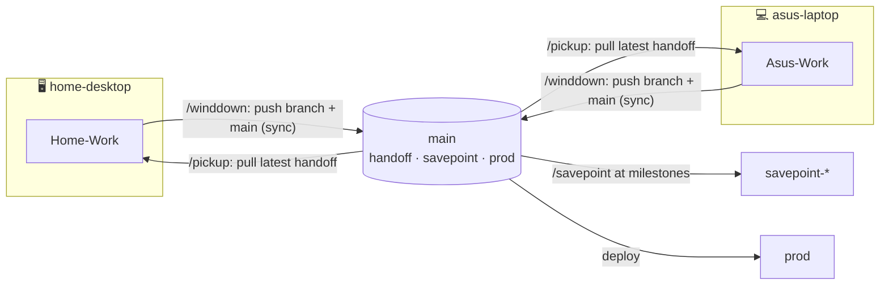

# Runbook — Device Sync & Handoff Protocol

> **What this is:** the ritual an AI agent runs at the **start** (PICKUP) and **end** (WIND-DOWN)
> of work on any machine, so multi-device development (home-desktop ⇄ asus-laptop) stays coherent —
> each agent always starts on the most-forward version and always leaves a clean handoff for the
> next machine's agent.
> **Audience:** you (the repo owner) + any AI agent (Claude Code / Codex).
> **Status:** ✅ Active. Companion to the **device-branch** convention (`device-branch-convention.md`);
> that one says *where to commit*, this one says *how to get in sync before* and *hand off after*.

---

## TL;DR

```
START of work  →  /pickup    → fetch all lanes · adopt the most-forward handoff into your
                               device branch · read HANDOFF.md · rebuild understanding · GO
END of work    →  /winddown  → commit → append HANDOFF.md entry → push device branch AND main
                               (kept in sync) → (optional /savepoint) → verify clean
Every session start, the SessionStart banner tells you if another device is ahead → run /pickup.
```

## Branch model (updated 2026-07-06)

| Branch | Role |
|--------|------|
| `Home-Work` | 🖥 home-desktop **working lane** — the DEFAULT commit target on the home desktop |
| `Asus-Work` | 💻 asus-laptop **working lane** — the DEFAULT commit target on the Asus laptop |
| `main` | **handoff + savepoint + stable + deployment/prod** branch — NOT a daily working lane |

- **Both devices default to their own working branch** (this changed 2026-07-06 — home-desktop no
  longer commits directly to `main`).
- **`main` is updated only at a handoff** (wind-down pushes the device branch **and** `main`, kept in
  sync) and at **savepoints/milestones** (`/savepoint`). Production deploys from `main`.
- **The most recent handoff always lives on `main`** (and on the device branch that did it). So the
  next machine gets the latest work by pulling `main`.



---

## 1. PICKUP — start of work (`/pickup`, or run on any SessionStart banner that says a device is ahead)

**Goal:** be on the most-forward-*appropriate* version before doing anything.

1. **Fetch every lane:** `git fetch origin` (main + both device branches + savepoints).
2. **Determine the most-forward-appropriate state** — NOT by raw commit count, but by reading the
   `.adr/current/development-progress.md` status board + `.docs/planning/*` + each lane's recent
   commits + the newest `HANDOFF.md` entry. Normally the latest handoff is on `origin/main`; that is
   the state to adopt. If the two device branches advanced **different** ADR areas, the answer is
   **both** → integrate both (never discard a lane's work).
3. **Adopt it into your device branch** (you keep working on your own lane, now updated):
   - Behind `origin/main` only → `git merge --ff-only origin/main` (fast-forward).
   - Local unpushed work + `main` moved → `git pull --rebase origin main` (rebase your work on top).
   - The **other** device branch is ahead of `main` (unreleased work) → surface it; integrate per the
     ADR/HANDOFF, or ask the user to promote it. **Never force-push; never discard.**
4. **Read the newest `HANDOFF.md` entry** (where the last agent stopped, next actions, blockers,
   gotchas) + skim the status board → rebuild your understanding of the app.
5. **Proceed** — pick up where the other agent left off.

> If lanes have genuinely DIVERGED (both have unique commits main doesn't) → **STOP and report**;
> reconcile with the user (rebase/merge/cherry-pick) before working. This mirrors the multi-agent
> "pull/rebase before push, never force-push" rule.

## 2. WIND-DOWN — end of work (`/winddown`)

**Goal:** leave the repo so the other machine's agent can resume cold.

1. **Commit everything** to your device branch: `git add -A && git commit` (nothing uncommitted).
2. **Append a `HANDOFF.md` entry** (device-labeled, newest on top — see the template in `HANDOFF.md`):
   what changed · where you stopped · next actions · blockers · gotchas · branch/commit. Commit it.
3. **Push the device branch AND sync `main`** (kept in sync at handoff):
   ```bash
   git push origin <Device>-Work                 # your working lane
   git push origin <Device>-Work:main            # fast-forward main to this handoff (stable/prod)
   ```
4. **(Optional) cut a savepoint** if this is a milestone/key point: `/savepoint <name>` (from `main`).
5. **Verify clean:** `git status` clean, `git rev-list --left-right --count origin/main...HEAD` = `0 0`
   (device branch == main == this handoff). The next `/pickup` on the other machine pulls `main`.

> Update `.chat-history/user-messages.md` and the status board as usual — those are the "understanding"
> layer this protocol ties together; `HANDOFF.md` is the "where we left off + next steps" layer.

---

## 3. What each piece is (component map)

| Piece | Path | Role |
|---|---|---|
| **HANDOFF.md** | repo root (tracked) | Append-only, per-device handoff log — the living "where we left off". |
| **skill** `device-sync-protocol` | `.claude/skills/device-sync-protocol/SKILL.md` (+ `.codex/`) | The pickup + wind-down step logic an agent follows. |
| **command** `/pickup` | `.claude/commands/pickup.md` (+ `.codex/`) | Run the pickup ritual. |
| **command** `/winddown` | `.claude/commands/winddown.md` (+ `.codex/`) | Run the wind-down ritual. |
| **agent** `device-sync-agent` | `.claude/agents/device-sync-agent/` (+ `.codex/`) | Executes the sync/handoff autonomously. |
| **hook** (extended) | `.claude/hooks/scripts/device-sync-check.sh` (+ `.codex/`) | SessionStart banner: reports if another device/`main` is ahead + HANDOFF freshness → tells you to `/pickup`. |
| **convention block** | `.claude/CLAUDE.md` · `.codex/CODEX.md` · `.codex/AGENTS.md` | Always-loaded pointer to this protocol. |
| **this runbook** | `.docs/runbooks/development/device-sync-and-handoff-protocol.md` | The full explanation. |
| **system docs** | `.codex/system_docs/device_sync_protocol/README.md` | Component reference + usage. |
| **staged package** | `.other-devices/components/device-sync-protocol/` | Portable copy for the other repos. |

## 4. Reading the SessionStart banner

| Banner line | Meaning | Do |
|---|---|---|
| `SYNCED with main` | device branch == main | proceed (still skim HANDOFF) |
| `main is AHEAD by N — run /pickup` | another device handed off; you're behind | run `/pickup` before working |
| `Asus-Work ahead of main by N (unreleased)` | the other lane has work not yet on main | `/pickup` will surface it |
| `HANDOFF: <device> <time> ago` | who wrote the last handoff + when | read that entry |
| `DIVERGED …` | both lanes moved | reconcile with the user before working |

## 5. Relationship to the device-branch convention
- `device.local.md` still resolves **which device this is** and thus **which working branch** is the
  default target — but the default is now the device's **working lane** (home→`Home-Work`,
  asus→`Asus-Work`), and "release to main" now means **handoff-sync + savepoint**, not a daily push.
- Resolution/push-gate logic: skill `device-branch-routing`. This protocol layers the **cross-device
  sync + handoff** on top.

## 6. Validation checklist (after any change to this component)
- [ ] `bash .claude/hooks/scripts/device-sync-check.sh` prints device + branch + `main`-ahead + HANDOFF freshness.
- [ ] `/pickup` fetches, reports divergence, and (fast-forward case) updates the device branch to `main`.
- [ ] `/winddown` commits, appends a HANDOFF entry, and pushes device branch + `main` in sync.
- [ ] `.claude` and `.codex` mirrors are aligned; system_docs entry exists; package staged in `.other-devices/`.

## 7. Related
- `device-branch-convention.md` — where each device commits (the working-lane resolver).
- `HANDOFF.md` — the living handoff log.
- `/savepoint` — milestone snapshots from `main`.
- Portable package: `.other-devices/components/device-sync-protocol/`.
